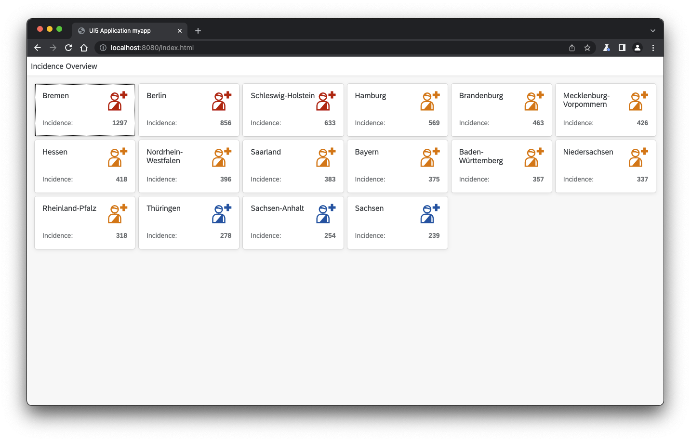

# ui5-typescript-tutorial - Learn App Development in UI5 and TypeScript

## Overview

This brief (~2-hours) tutorial introduces developers to UI5 application development *in TypeScript*. It includes creating a basic application from the TypeScript template using the ["easy-UI5"](https://github.com/SAP/generator-easy-ui5) generator, TypeScript coding in regular UI controllers, as well as advanced topics like custom control development and using third-party libraries.

## Requirements

The technical requirements to follow the tutorial are:

* A current version of [Node.js](https://nodejs.org/)
* A code editor supporting TypeScript development (preferably the free [Microsoft Visual Studio Code](https://code.visualstudio.com/), which was used to create the tutorial)

Required knowledge:

* You should have basic Javascript knowledge to avoid blind copy&paste without knowing what's going on
* Basic UI5 knowledge is beneficial, as this tutorial focuses on the TypeScript side of things.
* TypeScript knowledge is not required. If interested, having a quick look e.g. at [this brief TypeScript intro for JavaScript developers](https://www.typescriptlang.org/docs/handbook/typescript-in-5-minutes.html) might let you know what to expect.

## Exercises

The tutorial consists of the following exercises. To start, just [open the first link](exercises/ex0/) - you will be guided from there.

From the list, you can not only access each exercise directly, but also also browse the resulting sources and run the resulting app:
* [Exercise 0 - Getting Started](exercises/ex0/)
* [Exercise 1 - Create And Run Your Application](exercises/ex1/) (*[browse sources](exercises/ex1/com.myorg.myapp) - [run app](https://sap-samples.github.io/ui5-typescript-tutorial/exercises/ex1/)*)
* [Exercise 2 - Create the Initial User Interface and set up Routing](exercises/ex2/) (*[browse sources](exercises/ex2/com.myorg.myapp) - [run app](https://sap-samples.github.io/ui5-typescript-tutorial/exercises/ex2/)*)
* [Exercise 3 - Add Translated UI Texts](exercises/ex3/) (*[browse sources](exercises/ex3/com.myorg.myapp) - [run app](https://sap-samples.github.io/ui5-typescript-tutorial/exercises/ex3/)*)
* [Exercise 4 - Enhance the User Interface and Use Formatters](exercises/ex4/) (*[browse sources](exercises/ex4/com.myorg.myapp) - [run app](https://sap-samples.github.io/ui5-typescript-tutorial/exercises/ex4/)*)
* [Exercise 5 - Create a Second View](exercises/ex5/) (*[browse sources](exercises/ex5/com.myorg.myapp) - [run app](https://sap-samples.github.io/ui5-typescript-tutorial/exercises/ex5/)*)
* [Exercise 6 - Load Incidence History Data](exercises/ex6/) (*[browse sources](exercises/ex6/com.myorg.myapp) - [run app](https://sap-samples.github.io/ui5-typescript-tutorial/exercises/ex6/)*)
* [Exercise 7 - Create and Use a Custom Control](exercises/ex7/) (*[browse sources](exercises/ex7/com.myorg.myapp) - [run app](https://sap-samples.github.io/ui5-typescript-tutorial/exercises/ex7/)*)
* [Exercise 8 - Using NPM Packages](exercises/ex8/) (*[browse sources](exercises/ex8/com.myorg.myapp) - [run app](https://sap-samples.github.io/ui5-typescript-tutorial/exercises/ex8/)*)
* [Exercise 9 - Beautifying the Chart](exercises/ex9/) (*[browse sources](exercises/ex9/com.myorg.myapp) - [run app](https://sap-samples.github.io/ui5-typescript-tutorial/exercises/ex9/)*)

If you want to download the code for all the exercises, you can either [download the entire repository as zip file](https://github.com/SAP-samples/ui5-typescript-tutorial/archive/refs/heads/main.zip) and find the content in there below "ui5-typescript-tutorial-main/exercises/ex1/com.myorg.myapp" etc., or you can clone the repository using git. 

The resulting app after each exercise can also be [run from this page](https://sap-samples.github.io/ui5-typescript-tutorial). It includes additional links to unoptimized versions of the app, which can be used to debug the original TypeScript sources.

## High-Level Application Idea

As the *Covid* topic has been in global focus of attention for a long time now, the purpose of the application developed in this tutorial is to display Covid infection incidence data.

It uses an [open-source API for the German Covid data](https://github.com/marlon360/rki-covid-api) to display the incidence for all states of Germany on the overview page and a line chart with the incidence history of the selected state on a detail page.

In Germany (and thus in the app), the commonly used term "incidence" is defined as: "*number of detected infections per 100.000 persons within 7 days*".

A fallback copy of the data ensures that the tutorial can still be used when the API no longer works.

## How to obtain support

This repository is provided as-is, without any support guarantees. However, you are welcome to report issues via the [Issues](../../issues) tab and we'll see what we can do to fix them.

## License

Copyright (c) 2022 SAP SE or an SAP affiliate company. All rights reserved. This project is licensed under the Apache Software License, version 2.0 except as noted otherwise in the [LICENSE](LICENSES/Apache-2.0.txt) file.

The files inside the `backup_data` directory are created by the API copyright by Marlon Lückert and licensed under the [CC-BY-4.0 license](LICENSES/CC-BY-4.0.txt).
