# Getting Started

In this exercise, you will logon to your BTP Trial Account, create a new SAP Build Code project, open SAP Business Application Studio, and get a brief overview.

## Logon

After completing these steps you will know how to open SAP Business Application Studio and prepare it for development.

1. Open a browser of your choice (Google Chrome, Microsoft Edge, Apple Safari, etc).

2. Open [SAP BTP Trial](https://account.hanatrial.ondemand.com/trial/#/home/trial), login with your credentials and go to your trial account. If the login doesn't work, make sure you fulfill the [requirements](../../../README.md#requirements).
  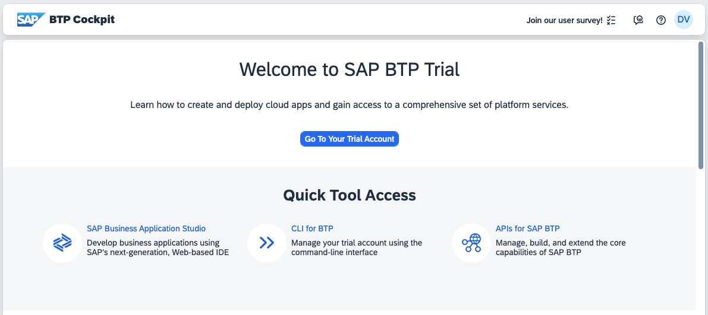

3. Navigate to your "trial" subaccount.
  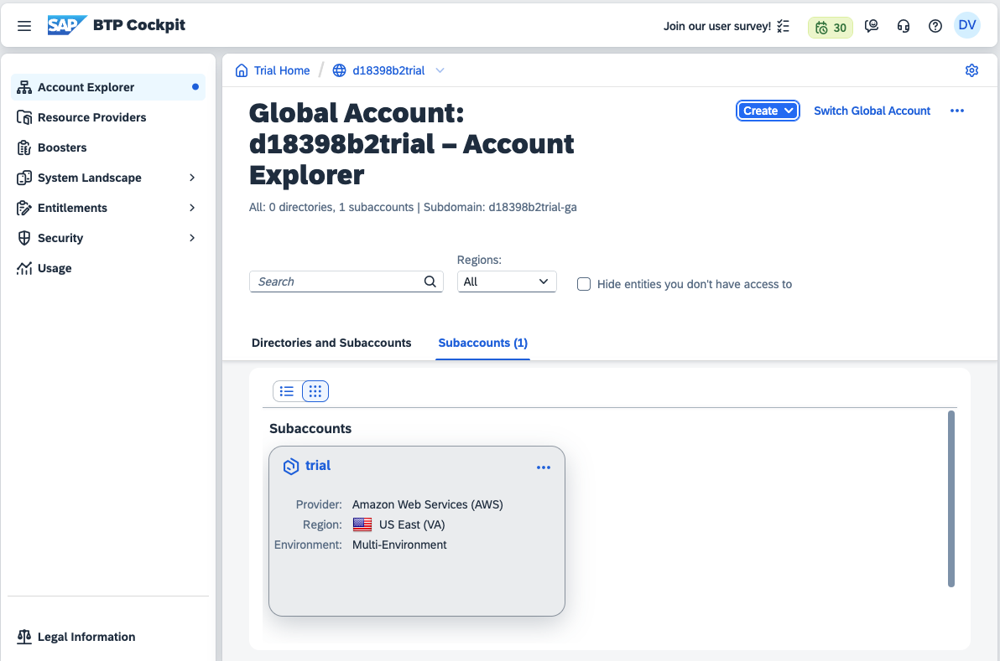

4. Navigate to the Service Marketplace, select the SAP Build Code tile, and press the "Go to Application" button.
  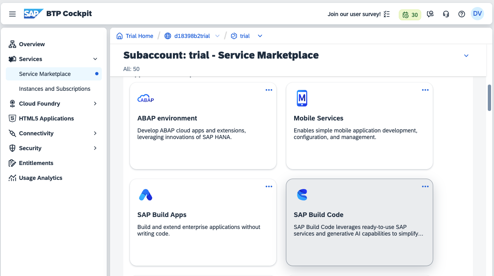
  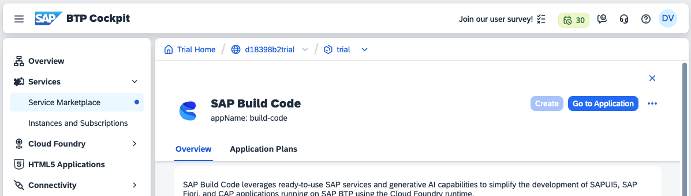

6. Press the "Create" button and select the "Create" option.
  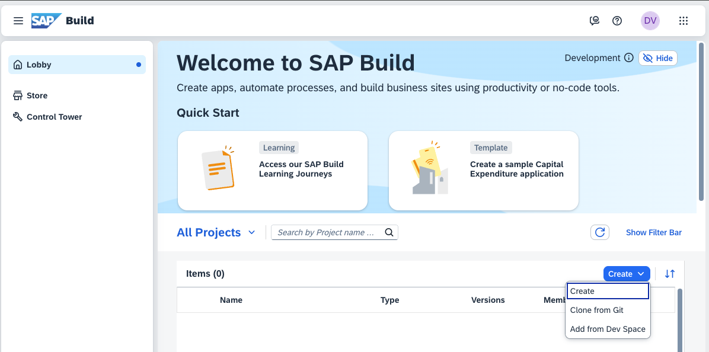

7. Select "Build an Application", then select "SAP Build Code", and finally select "SAP Fiori Application".
  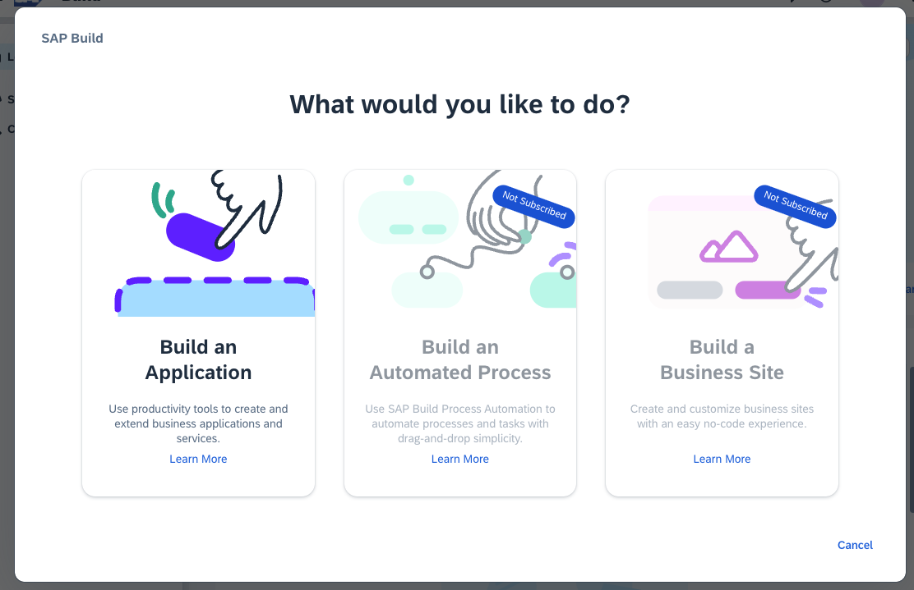
  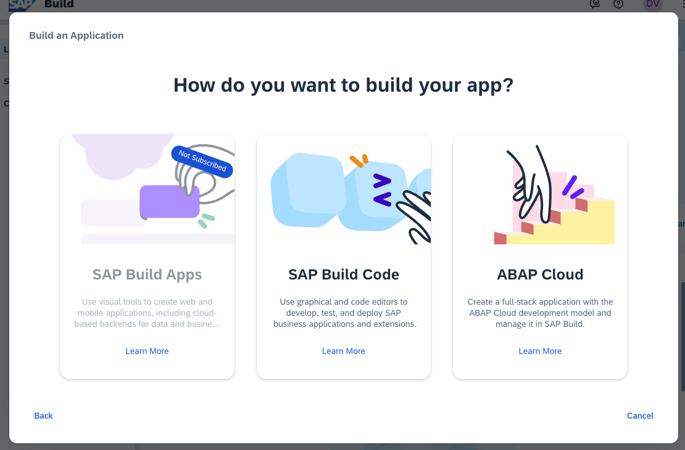
  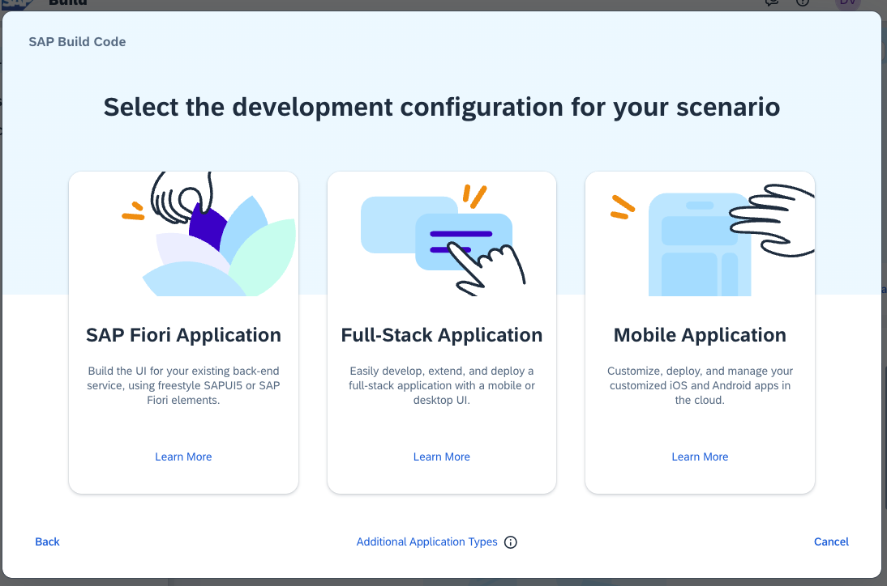

8. Enter the new name of your project, e.g. *DSAG_2025* as project name and create the SAP Fiori project.
  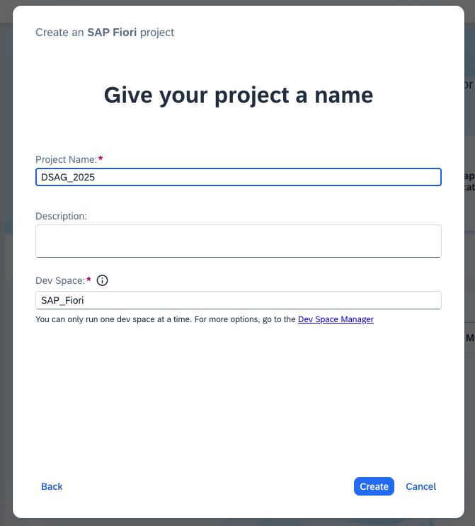

9. Your project alongside the dev space is being prepared and starts up. This might take a few minutes. Wait until the status shows *RUNNING*.
  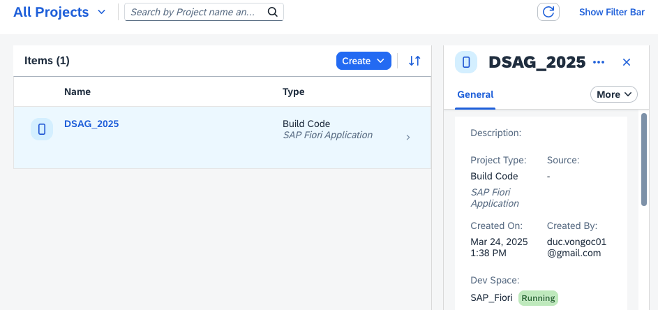

10. Click on your project name, e.g. *DSAG_2025*, this will open your newly created  project space inside of SAP Business Application Studio.
  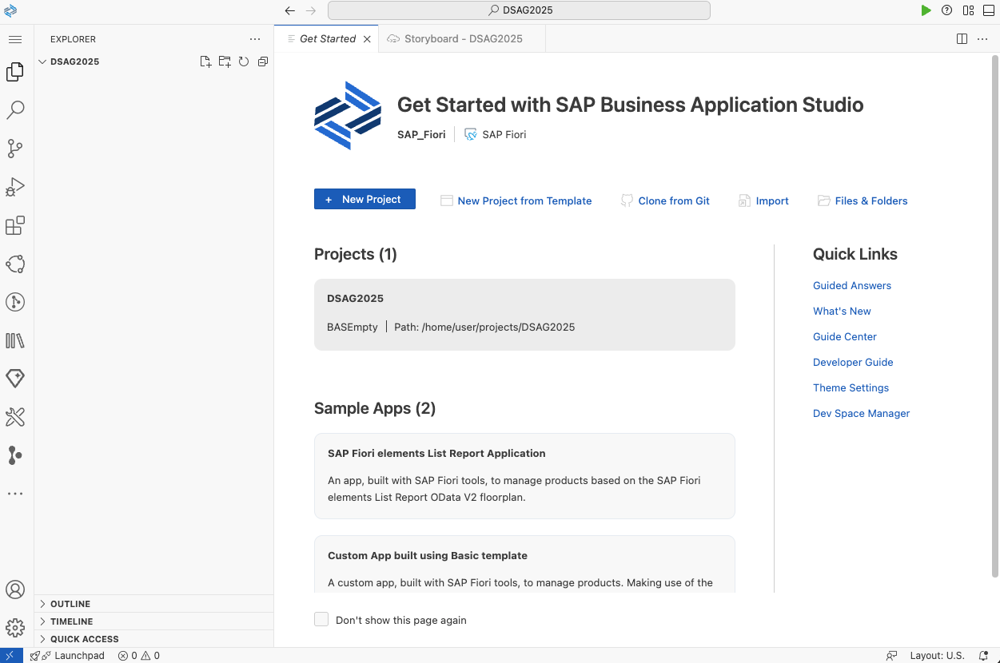

11. Bookmark this URL, so it'll be easier for you to access your dev space within SAP Business Application Studio.

## Summary

Congratulations, you completed the [Getting Started](#getting-started) exercise!

Continue to [Exercise 1 - Project Setup Using Easy-UI5](../ex1/README.md).
