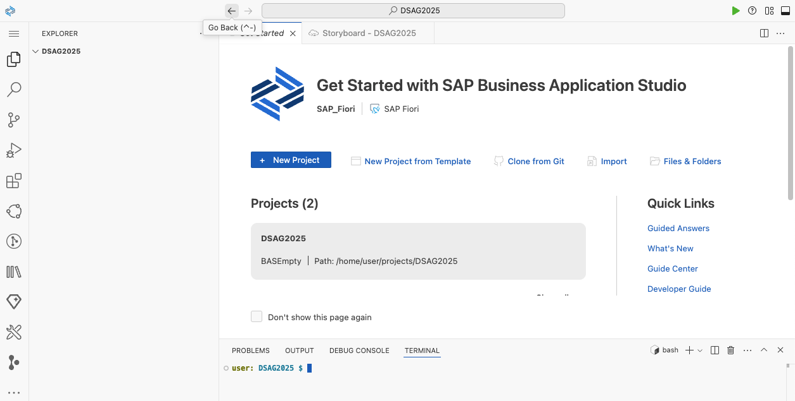
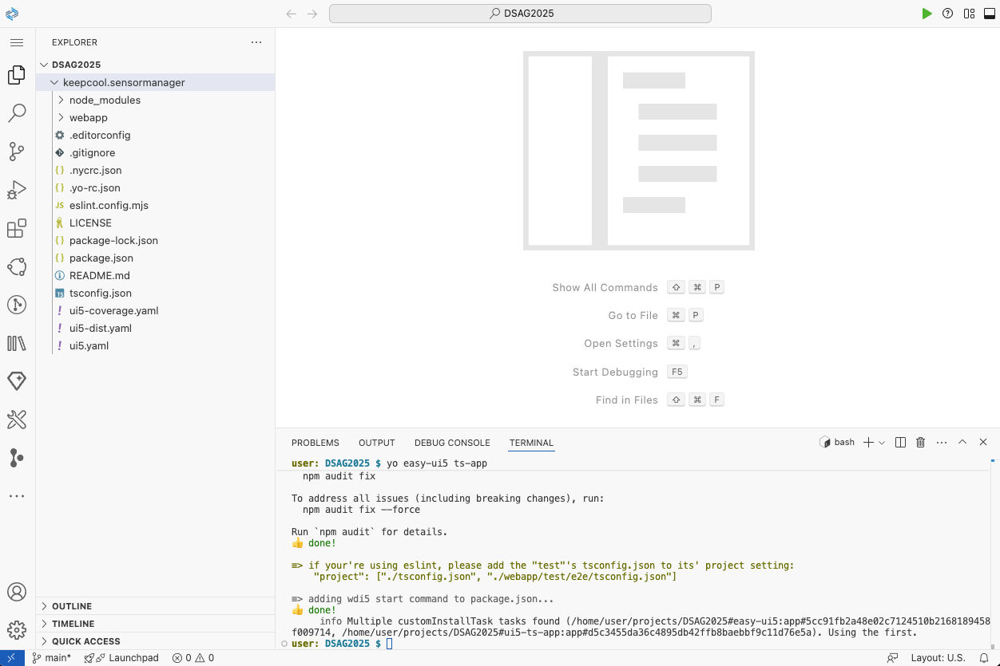
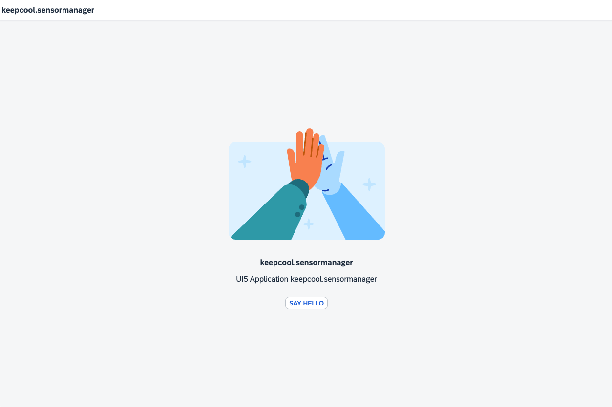

[](sensormanager)

# Exercise 1 - Project Setup Using Easy-UI5

In this exercise you'll create a new UI5 application using [Yeoman](https://yeoman.io/)
and [Easy-UI5](https://github.com/SAP/generator-easy-ui5/).

## Scenario

Your customer "Keep Cool, Inc." is an operator of several icehouses across the country. Recently, they have been upgraded with new sensors with Internet connection, so that their measuring values are available as a service. To make use of this data and improve their internal workflows, the company asked us to provide an application leveraging this sensor data, visualize it, and provide an overview of the current state of each sensor, so that they can react quickly on any issues.

## Exercise 1.1 - Create a New UI5 Application

After completing these steps you'll have created your first UI5 application.

1. Open the terminal by clicking on the icon in the upper right corner.
<br><br><br><br>

2. Install [Yeoman](https://yeoman.io/) and the [Easy-UI5 generator](https://github.com/SAP/generator-easy-ui5/) via NPM by running the following command in the terminal:
```
npm i -g yo generator-easy-ui5
```

3. Use *Easy-UI5* to generate a new UI5 application using TypeScript with the following command in the terminal:
```
yo easy-ui5 ts-app
```

4. The generator will ask you to provide several settings, enter the following settings in the terminal (you can use the suggested value by pressing *ENTER*):
```
? Enter your application id (namespace)? keepcool.sensormanager
? Which framework do you want to use? SAPUI5
? Which framework version do you want to use? 1.134.0
? Who is the author of the application? Duc Vo Ngoc
? Would you like to create a new directory for the application? Yes
? Would you like to initialize a local git repository for the application? No
```

5. *Easy-UI5* will generate a UI5 TypeScript application, which will incorporate the latest best-practices. Once installation and generation is done, you should see a new folder *keepcool.sensormanager* containing your project files.
<br><br><br><br>

## Exercise 1.2 - Try out the generated Application

It's time for a first preview of your newly created application!

Before previewing your application, make sure to change the directory in the terminal to your newly created project, e.g.:
```
cd keepcool.sensormanager
```

You can preview the application by executing the following command in the terminal:
```
npm run start
```

After a few moments, the application should start up as following:
<br><br><br><br>

## Summary

Hooray! You've successfully accomplished [Exercise 1 - Project Setup Using Easy-UI5](#exercise-1---project-setup-using-easy-ui5)!

Continue to [Exercise 2 - Basic UI5 Configuration and  View Creation](../ex2/README.md).
