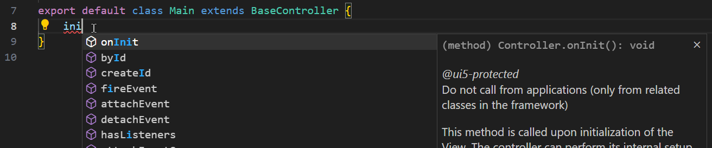
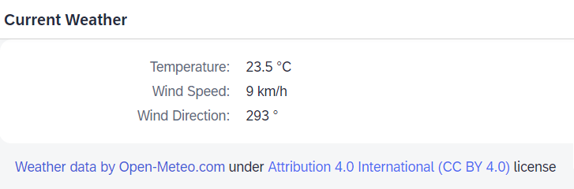

# Exercise 2 - Create the Initial User Interface and Load Data

In this exercise, you will load weather data and display it. And learn a lot about how TypeScript helps with writing code.

## Exercise 2.1 - Understand how TypeScript and Modern JavaScript Syntax Influence the Code

After completing this section, you will have a basic understanding of how UI5 application code looks different due to TypeScript and due to the modern JavaScript syntax which we suggest to use in TypeScript applications.

1.  Open the file `webapp/Component.ts` in a TypeScript-aware code editor of your choice (e.g. Visual Studio Code).

	Now look at the overall file structure. It starts with `import` statements and a class definition:

	```ts
	import UIComponent from "sap/ui/core/UIComponent";
	import models from "./model/models";
	import Device from "sap/ui/Device";


	/**
	 * @namespace com.myorg.myapp
	 */
	export default class Component extends UIComponent {
	...
	```

	Both do not have anything to do with TypeScript! This is just modern JavaScript syntax for loading dependencies and for defining classes.

	But this syntax is still important to understand for writing UI5 apps in TypeScript: Because TypeScript code anyway needs to be transpiled before being executed (browsers cannot execute TypeScript, only JavaScript!), UI5 decided to add another conversion step during transpilation. This step converts this modern syntax to traditional UI5 dependency loading (with `sap.ui.require(...)` or `sap.ui.define(...)`) and class definition (with `UIComponent.extend(...)`).

	The `@namespace` JSDoc comment above the class definition is required for enabling this conversion to construct the full name of the class in UI5 terms.

	How member methods and properties like the metadata are written inside the class body is also standard JavaScript class syntax.

2. Actual TypeScript syntax only has extremely little footprint in this file - everything else is pure JavaScript:
   1.  The "string" type for the private member variable `private contentDensityClass : string;`
   2.  The return types of the two member methods, e.g. "string" for the `public getContentDensityClass() : string {...` method

3.  The first benefits of TypeScript can be seen when you hover the mouse pointer above class names like `UIComponent` or called methods like `super.init()`: the editor displays the respective API documentation in-place.

	

4.  Depending on the used code editor, you can also navigate to the definition of the respective UI5 API. E.g. in VSCode by holding the `Ctrl` key while clicking the name (`Cmd`+click on MacOS). This does not lead to the original source code of UI5, which is written in JavaScript, but to the TypeScript type definition files of UI5. Nevertheless it can be very helpful to browse through the methods offered by a class or to navigate further up the inheritance chain.

5.  There are further benefits of TypeScript, e.g. providing code completion and development-time error checks. You will learn about them in subsequent steps.

## Exercise 2.2 - Create a Model

After completing this step, a model for storing weather data will be created. This is the first step where you actually write code. It will hence provide another glimpse of the benefits TypeScript provides.

> :warning: **Remark:** whenever you completed a step in this tutorial and the result does not show up in the browser as expected, make sure you saved all changes! This sounds trivial, but is actually the single most frequent cause of issues.

1.	In the file `webapp/controller/Main.controller.ts`, delete the `public sayHello() ...` method and at its previous location instead create the `onInit` method to execute code when the controller is instantiated. 

	In the end, the method should look like this:
	```ts
		onInit(): void {
			const model = new JSONModel();
			this.setModel(model);
		}
	```
	But to experience how code assist works and makes development more efficient, we recommend that you just start typing "ini" manually and keep an eye on the suggestions provided by your editor!

	

	The editor knows that all Controllers have an `onInit` method and not only suggests to add it, but also shows the according documentation right away. You will not accidentally name the method `init()` anymore and you don't need to type all the braces - just accept the suggestion and you get the method body for free:
	```js
		onInit(): void {
			
		}
	```

2. Now continue implementing the method by creating a model and setting it on the view. Start typing `const model = new JS` and again there is a helpful suggestion: even though the class `JSONModel` is not yet available within the file, TypeScript knows that it exists and suggests it, as soon as you typed `new JS`. Selecting it from the list will not only complete the written code, but also add the required `import` statement at the top of the file.

	

	If you just type `JSONModel` without selecting anything from the list, the import may not be created. Instead, an error will notify you that the class is not known.

	

	You could then manually type the import, but at least in Visual Studio Code the error popup does also offer a "Quick Fix..." option, which upon selection suggests adding the missing import.
	
	

	To complete this step of the exercise, you have to add the import using any of the above ways.

	Then, set the created model on the View. Similarly, as you type `this.setM`, the editor will suggest the `setModel` method.

	As mentioned, in the end, the method should look like this:
	```ts
		onInit(): void {
			const model = new JSONModel();
			this.setModel(model);
		}
	```

	Keep these features in mind as you write more TypeScript code in the subsequent exercises, as they help you proceeding faster and are some of the main reasons for using TypeScript.


## Exercise 2.3 - Load Data

1. We now need to load the data. To do so, after the end of the `onInit` method body, add this method:

	```ts
		async loadWeatherData(lat = "49.31", lon = "8.64") { // default coordinates: Walldorf
			const response = await fetch(`https://api.open-meteo.com/v1/forecast?latitude=${lat}&longitude=${lon}&current_weather=true`);
			const jsonData = await response.json();
			this.getModel().setData(jsonData);
		}
	```
	Ignore the displayed error for the time being - we'll deal with it later. TypeScript transpiles the code despite this error.

	> While some parts might look unfamiliar, this is all pure JavaScript code without any type information or TypeScript-specific syntax. It uses some relatively modern JavaScript constructs like an [`async`/`await`](https://developer.mozilla.org/en-US/docs/Web/JavaScript/Reference/Statements/async_function), [default parameters](https://developer.mozilla.org/en-US/docs/Web/JavaScript/Reference/Functions/Default_parameters) (default values for the `lat`/`lon` method parameters), the [`fetch` API](https://developer.mozilla.org/en-US/docs/Web/API/Fetch_API) for loading remote data and a [template string](https://developer.mozilla.org/en-US/docs/Web/JavaScript/Reference/Template_literals) for easier string concatenation.<br>
	But essentially it simply loads weather data for the given coordinates in JSON format and puts it into the model.

	Although you have written zero type information, the TypeScript compiler uses [*type inference*](https://www.typescriptlang.org/docs/handbook/type-inference.html) to determine the type of variables where possible. So the `response` constant, for example, is fully typed, as TypeScript knows what is returned by the fetch API. If you remove the `.json()` part and re-add the dot, the editor will offer you all the properties and methods available on objects of type `Response` (this type does not need to be explicitly imported for this functionality).<br>
	Also the method parameters are already typed based their default values.

	For more information regarding the used weather API, please check https://open-meteo.com/en/docs. We are using this free API under [non-commercial terms](https://open-meteo.com/en/terms), by *"Incorporating the service into educational content"*.

	The response to [the request](https://api.open-meteo.com/v1/forecast?latitude=49.31&longitude=8.64&current_weather=true) looks like this:

	```json
	{
		"latitude": 49.32,
		"longitude": 8.639999,
		"generationtime_ms": 0.2900362014770508,
		"utc_offset_seconds": 0,
		"timezone": "GMT",
		"timezone_abbreviation": "GMT",
		"elevation": 105.0,
		"current_weather": {
			"temperature": 23.6,
			"windspeed": 8.9,
			"winddirection": 297.0,
			"weathercode": 3,
			"is_day": 1,
			"time": "2023-06-27T11:00"
		}
	}
	```

2. Finally call this method *at the end of the `onInit` method* by inserting the following after the model has been set:
	```ts
	this.loadWeatherData();
	```
	Again, you will not need to type the entire method name, but you can select it from the suggestion list after typing `this.l` or simply confirm the only remaining suggestion after typing `this.loadW`.

3. 	For `this.getModel().setData()` an error is displayed, saying *"Property 'setData' does not exist on type 'Model'"*. This is because the `getModel()` method returns the base class `sap.ui.model.Model` - after all it could also be e.g. an ODataModel. What it actually is, is determined at runtime by what the application set earlier on. You know for sure it is a `JSONModel`, so you can resolve this error using a *type cast* - basically telling the compiler which concrete model class it is:

	```ts
	(this.getModel() as JSONModel).setData(jsonData);
	```

	There are other ways to deal with it in this case, e.g. assigning the model to a typed member variable of the controller instead of fetching it with the `getModel()` method, but sometimes type casts are needed and we are here to learn about TypeScript, aren't we?

## Exercise 2.4 Fix Linting Errors and Define a Custom Type
1. When you run `npm run lint`, you will see errors and a warning reported:
	```
	1:8  warning  'MessageBox' is defined but never used
								@typescript-eslint/no-unused-vars
	12:3  error    Promises must be awaited, end with a call to .catch, end with a call to .then with a rejection handler or be explicitly marked as ignored with the `void` operator
								@typescript-eslint/no-floating-promises
	16:9  error    Unsafe assignment of an `any` value
								@typescript-eslint/no-unsafe-assignment
	17:3  error    Unsafe call of an `any` typed value
								@typescript-eslint/no-unsafe-call
	```											  

	To fix the first two, remove the very first line in the file importing the unused MessageBox and write the operator `void` in front of `this.loadWeatherData()`. This (rarely used) JavaScript operator indicates that it is ok that this asynchronous method returns later, long after the `onInit()` method has been processed and left:
	```ts
		void this.loadWeatherData();
	```

2. The two remaining linting errors hint that you are working with variables of type `any`, which undermines the type checks. What you can do - besides disabling this rule here or in the entire app - is defining the response structure of the weather service as your own custom type! It's straightforward and can be done right in the implementation file, although in real projects you often bundle such types in one place.

	Insert the following definition of the weather data structure e.g. right after the `import` statements close to the beginning of the file:

	```ts
	type WeatherInfo = {
		current_weather: {
			temperature: number,
			windspeed: number,
			winddirection: number
		}
	}
	```
	
	> It is sufficient to define the properties we are interested in. Actually it doesn't matter here at all what we define, as the value is only set to the JSONModel, which in turn also accepts any kind of structure.

	Then use this type to declare with a type cast what kind of JSON structure is provided by the fetch response:

	```ts
		const jsonData = await response.json() as WeatherInfo;
	```

	Trying `npm run lint` again shows: the errors and warning are gone.

	In the end, the Main controller should look like this:

	```ts
	import BaseController from "./BaseController";
	import JSONModel from "sap/ui/model/json/JSONModel";

	type WeatherInfo = {
		current_weather: {
			temperature: number,
			windspeed: number,
			winddirection: number
		}
	}

	/**
	 * @namespace com.myorg.myapp.controller
	 */
	export default class Main extends BaseController {
		onInit(): void {
			const model = new JSONModel();
			this.setModel(model);
			void this.loadWeatherData();
		}
		
		async loadWeatherData(lat = "49.31", lon = "8.64") { // default coordinates: Walldorf
			const response = await fetch(`https://api.open-meteo.com/v1/forecast?latitude=${lat}&longitude=${lon}&current_weather=true`);
			const jsonData = await response.json() as WeatherInfo;
			(this.getModel() as JSONModel).setData(jsonData); 
		}
	}
	```

## Exercise 2.5 - Extend the User Interface

After completing the following steps, the main view will display the current weather for Walldorf.

1. Open the file `webapp/view/Main.view.xml` and replace the `<MessagePage>...</MessagePage>` block with the following content:
	```xml
		<Page id="page" title="Current Weather">
			<content>
				<form:SimpleForm>
					<Label text="Temperature" />
					<Text text="{/current_weather/temperature} °C" />
					
					<Label text="Wind Speed" />
					<Text text="{/current_weather/windspeed} km/h" />
					
					<Label text="Wind Direction" />
					<Text text="{/current_weather/winddirection} °" />
				</form:SimpleForm>

				<FormattedText class="sapUiResponsiveMargin" htmlText="&lt;a href='https://open-meteo.com/'&gt;Weather data by Open-Meteo.com&lt;/a&gt; under &lt;a href='https://creativecommons.org/licenses/by/4.0/'&gt;Attribution 4.0 International (CC BY 4.0)&lt;/a&gt; license" />

			</content>
		</Page>
	```

	The view now contains a Page control with a `sap.ui.layout.form.SimpleForm` inside. In this form, several texts are bound to properties in the weather data loaded above.

	Below the form, a short text gives due credit to the used API.

2.	To the list of attributes for the opening `<mvc:View...` tag, add the following one:
	```xml
		xmlns:form="sap.ui.layout.form"
	```
	As result, the `Main.view.xml` file should look like this:
	```xml
	<mvc:View
		controllerName="com.myorg.myapp.controller.Main"
		displayBlock="true"
		xmlns="sap.m"
		xmlns:mvc="sap.ui.core.mvc"
		xmlns:core="sap.ui.core"
		xmlns:form="sap.ui.layout.form"
		core:require="{
			formatter: 'com/myorg/myapp/model/formatter'
		}">

		<Page id="page" title="Current Weather">
			<content>
				<form:SimpleForm>
					<Label text="Temperature" />
					<Text text="{/current_weather/temperature} °C" />
					
					<Label text="Wind Speed" />
					<Text text="{/current_weather/windspeed} km/h" />
					
					<Label text="Wind Direction" />
					<Text text="{/current_weather/winddirection} °" />
				</form:SimpleForm>

				<FormattedText class="sapUiResponsiveMargin" htmlText="&lt;a href='https://open-meteo.com/'&gt;Weather data by Open-Meteo.com&lt;/a&gt; under &lt;a href='https://creativecommons.org/licenses/by/4.0/'&gt;Attribution 4.0 International (CC BY 4.0)&lt;/a&gt; license" />

			</content>
		</Page>

	</mvc:View>
	```

3.  The additionally used `sap.ui.layout` control library must be registered as dependency for the UI5 build tools. In the file `ui5.yaml` find the `framework` > `libraries` section and add the following entry to the list:

	```yaml
	- name: sap.ui.layout
	```
	> :warning: **Remark:** the same can be achieved using the UI5 tooling by executing `npx ui5 add sap.ui.layout`

	Do the same in the file `ui5-dist.yaml` and make sure for both that the indentation is correct.


4.  This new dependency also needs be added to the application manifest. In the file `webapp/manifest.json`, find the `sap.ui5` > `dependencies` > `libs` section and append the following entry to the list.

	```json
	"sap.ui.layout": {}
	```
	Don't forget adding a comma after the previous entry.

5.	Even if you have `npm start` still active, which means the UI5 tools run in watch mode, these changes to the UI5 project configuration (adding the sap.ui.layout library) require a restart. Hence please stop the `npm start` process in case it is still running and launch it again.

The app now displays current weather data for Walldorf.



## Summary

You've now loaded data and extended the UI to display it.

Along the way, you have learned a LOT about TypeScript in UI5 apps:
* how it allows using modern JavaScript syntax with ES6 classes and modules
* that it provides inline documentation and a way to navigate to the definitions
* where to typically spot the little actual TypeScript syntax among all the JavaScript
* how it helps with automatic code completion, adding imports and "Quick Fixes", which both reduce the amount of required typing
* how it types variables via type inference even when you do not provide type information
* that you have to provide the namespace via JSDoc for classes you define
* how linting makes you aware of possible issues beyond the regular type chacking
* how you can use and define your own custom types.

Continue to - [Exercise 3 - React on User Input](../ex3/README.md)
