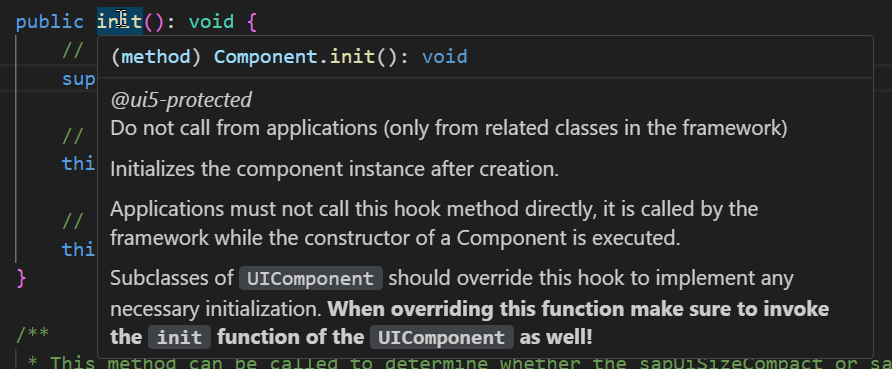
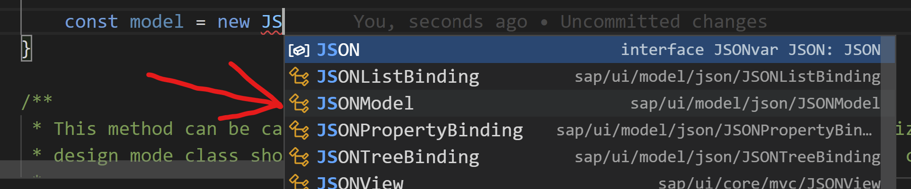
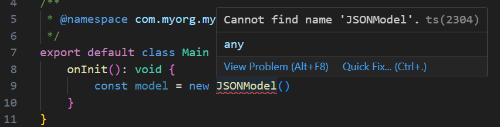
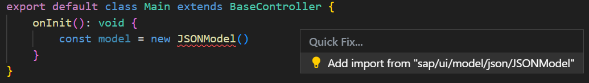
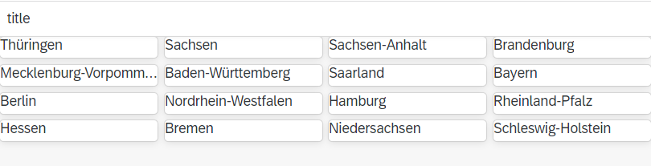

# Exercise 2 - Create the Initial User Interface and set up Routing

In this exercise, you will load live data and display first parts of it: the states of Germany. Actual Covid incidence data will be added later.

## Exercise 2.1 Understand how TypeScript and Modern JavaScript Syntax Influence the Code

After completing this section, you will have a basic understanding of how UI5 application code looks different due to TypeScript and due to the modern JavaScript syntax which we suggest to use in TypeScript applications.

1.  Open the file `src/Component.ts` in a TypeScript-aware code editor of your choice (e.g. Visual Studio Code).

	Now look at the overall file structure. It starts with two `import` statements and a class definition:

	```ts
	import UIComponent from "sap/ui/core/UIComponent";
	import { support } from "sap/ui/Device";

	/**
	 * @namespace com.myorg.myapp
	 */
	export default class Component extends UIComponent {
	...
	```

	Both do not have anything to do with TypeScript! This is just modern JavaScript syntax for loading dependencies and for defining classes.

	But this is still important to understand in the TypeScript context. Because TypeScript code anyway needs to be transpiled before being executed (browsers cannot execute TypeScript, only JavaScript!), UI5 decided to add another conversion step during transpilation. This step converts this modern syntax to traditional UI5 dependency loading (with `sap.ui.require(...)` or `sap.ui.define(...)`) and class definition (with `UIComponent.extend(...)`).

	The `@namespace` JSDoc comment above the class definition is required for enabling this conversion to construct the full name of the class in UI5 terms.

	How member methods and properties like the metadata are written inside the class body is also standard JavaScript syntax.

2. Actual TypeScript syntax only has extremely little footprint in this file:
   1.  The "string" type for the private member variable `private contentDensityClass : string;`
   2.  The return types of the two member methods, e.g. "string" for the `public getContentDensityClass() : string {...` method

3.  The first benefits of TypeScript can be seen when you hover the mouse pointer above class names like `UIComponent` or called methods like `super.init()`: the editor displays the respective API documentation in-place.

	

4.  Depending on the used code editor, you can also navigate to the definition of the respective UI5 API. E.g. in VSCode by holding the `Ctrl` key while clicking the name. This does not lead to the original source code of UI5, which is written in JavaScript, but to the TypeScript type definition files of UI5. Nevertheless it can be very helpful to browse through the methods offered by a class or to navigate further up the inheritance chain.

5.  There are further benefits of TypeScript, e.g. providing code completion and development-time error checks. You will learn about them in subsequent steps.

## Exercise 2.2 Load Data

After completing this step, the data will be loaded. This is the first step where you actually write code. It will hence provide another glimpse of the benefits TypeScript provides.

> **REMARK**: whenever you completed a step in this tutorial and the result does not show up in the browser as expected, make sure you saved all changes! This sounds trivial, but is actually the most frequent cause for issues.

1.	In the file `src/Component.ts`, find the `public init() : void {...` method and insert the following lines after the `super.init();` call. To experience how code completion works and makes development more efficient, we recommend that you type this block of code manually as described below and keep an eye on the suggestions provided by your IDE!

	```js
			const model = new JSONModel("https://api.corona-zahlen.org/states");
			this.setModel(model);
	```

	> **Remark** if the URL does not work, you can use this one instead, which contains a static copy of the data: https://sap-samples.github.io/ui5-typescript-tutorial/backup_data/states.json

	Even though the class `JSONModel` is not yet available within the file, TypeScript knows that it exists and suggests it, as soon as you typed `new JSON`. Selecting it from the list will not only complete the written code, but also add the required `import` statement at the top of the file.

	

	If you just type `JSONModel` without selecting anything from the list, the import may not be created. Instead, an error will notify you that the class is not known.

	

	You could then manually type the import, but at least in Visual Studio Code the error popup does also offer a "Quick Fix..." option, which upon selection suggests adding the missing import.
	
	

	To complete this step of the exercise, you have to add the import using any of the above ways.

	Similarly, as you type `this.setM`, the editor will suggest the `setModel` method.

	Keep these features in mind as you write more TypeScript code in the subsequent exercises, as they help you proceeding faster and are some of the main reasons for using TypeScript.


	The `JSONModel` loads the data from the given URL and makes it available for binding UI controls against it. The structure of the data looks like this:
	```json
	{
		"data": {
			"SH": {
				"id": 1,
				"name": "Schleswig-Holstein",
				"population": 2910875,
				"cases": 107395,
				"deaths": 1850,
				"casesPerWeek": 4753,
				"deathsPerWeek": 5,
				"recovered": 96809,
				"abbreviation": "SH",
				"weekIncidence": 163.2842358397389,
   	         ...
	```

	Below the `data` node there is a map of German states (by ID / abbreviation). You will use their `name` property in this exercise and their `weekIncidence` property in the next one.

## Exercise 2.3 Extend the User Interface

After completing these steps, the main view will display a grid list of states in Germany.

1. Open the file `src/view/Main.view.xml` and replace the `<MessagePage>...</MessagePage>` block with the following content:
	```xml
		<Page id="page" title="{i18n>title}">
			<content>
				<f:GridList id="statesList" 
					items="{path: '/data', sorter: {path: 'weekIncidence', descending: true}}"
					noDataText="No state data">
					<f:customLayout>
						<grid:GridBoxLayout/>
					</f:customLayout>
					<f:items>
						<CustomListItem>
							<Title text="{name}"/>
						</CustomListItem>
					</f:items>
				</f:GridList>
			</content>
		</Page>
	```

2.	To the list of attributes for the opening `<mvc:View...` tag, add the following two:
	```xml
		xmlns:f="sap.f"
		xmlns:grid="sap.ui.layout.cssgrid"
	```
	As result, the file should look like this:
	```xml
	<mvc:View
		controllerName="com.myorg.myapp.controller.Main"
		displayBlock="true"
		xmlns="sap.m"
		xmlns:f="sap.f"
		xmlns:grid="sap.ui.layout.cssgrid"
		xmlns:mvc="sap.ui.core.mvc">

		<Page id="page" title="{i18n>title}">
			<content>
				<f:GridList id="statesList" 
					items="{path: '/data', sorter: {path: 'weekIncidence', descending: true}}"
					noDataText="No state data">
					<f:customLayout>
						<grid:GridBoxLayout/>
					</f:customLayout>
					<f:items>
						<CustomListItem>
							<Title text="{name}"/>
						</CustomListItem>
					</f:items>
				</f:GridList>
			</content>
		</Page>

	</mvc:View>
	```

	The view now contains a Page control with a `sap.f.GridList` inside. The items of the GridList are bound to the `/data` path inside the model data loaded above.

	The `sorter: {path: 'weekIncidence', descending: true}` part of the binding sorts the states descending by weekly Covid incidence.

3.  The additionally used `sap.f` control library must be registered as dependency for the UI5 build tools. In the file `ui5.yaml` find the `framework` > `libraries` section and add the following entry to the list:

	```yaml
	- name: sap.f
	```
	> **Remark** the same can be achieved using the UI5 tooling by executing `npx ui5 add sap.f`

	Do the same in the file `ui5-dist.yaml`.


4.  This new dependency also needs be added to the application manifest. In the file `src/manifest.json`, find the `sap.ui5` > `dependencies` > `libs` section and add the following entry to the list.

	```json
	"sap.f": {},
	```

5.	Even if you have `npm start` still active, which means the UI5 tools run in watch mode, reloading the browser on every code change, these changes to the UI5 project configuration (adding the sap.f library) require a full restart. Hence please stop the `npm start` process in case it is still running and launch it again.

The app now will display a grid list with the states of Germany.



The layout is not so nice yet, the page title looks odd and there is no actual incidence data. These issues are taken care of in the next exercises.

## Summary

You've now loaded data and extended the UI to display first parts of this data.

Along the way, you have learned a lot about TypeScript in UI5 apps:
* how it allows using modern JavaScript syntax
* that it provides inline documentation and a way to navigate to the definitions
* where to spot actual TypeScript syntax
* how it helps with automatic code completion and "Quick Fixes", which both reduce the amount of required typing.

Continue to - [Exercise 3 - Add Translated UI Texts](../ex3/README.md)
