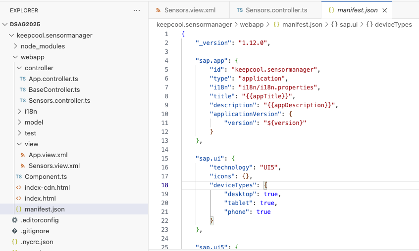
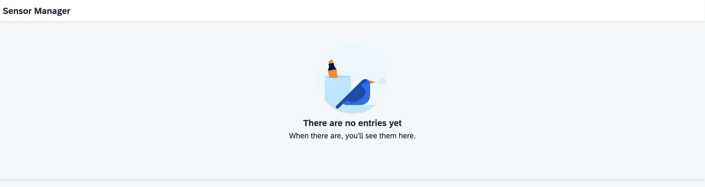

[](sensormanager)

# Exercise 2 - Basic UI5 Configuration and View Creation

In this exercise you'll add some content to your application. A new UI5 view showing multiple sensors will be the first part of your app.

## Exercise 2.1 - Check Theming

SAP Horizon is SAP’s new target design system. It evolves the SAP Fiori design for all SAP products to fully support the Intelligent Suite, running on any device. The Easy-UI5 generator explicitly sets the theme to SAP Horizon, which is technically not necessary. If no theme is specified, a theme fallback mechanism ensures the latest theme is used.

1. Click on the files icon at the top of the icon bar at the left and open `keepcool.sensormanager/webapp/index.html`.

2. Remove the attribute `data-sap-ui-theme`, as we want to use the theme fallback.

	***keepcool.sensormanager/webapp/index.html***

	````html
	<!doctype html>
	<html>
		<head>
			<meta http-equiv="Cache-control" content="no-cache, no-store, must-revalidate" />
			<meta http-equiv="Pragma" content="no-cache" />
			<meta http-equiv="expires" content="0" />
			<meta charset="utf-8" />

			<title>UI5 Application: keepcool.sensormanager</title>

			<script
				id="sap-ui-bootstrap"
				src="resources/sap-ui-core.js"
				data-sap-ui-resource-roots='{
					"keepcool.sensormanager": "./"
				}'
				data-sap-ui-on-init="module:sap/ui/core/ComponentSupport"
				data-sap-ui-compat-version="edge"
				data-sap-ui-frame-options="trusted"
				data-sap-ui-async="true"
				data-sap-ui-xx-waitForTheme="true"
				data-sap-ui-xx-supportedLanguages="en,de"
			></script>
		</head>

		<body class="sapUiBody">
			<div data-sap-ui-component data-name="keepcool.sensormanager"></div>
		</body>
	</html>
	````

## Exercise 2.2 - Adjusting Views

Easy-UI5 created two views for you: `App.view.xml` and `Main.view.xml`.

Let's take a look at the precreated view `App.view.xml` located under `keepcool.sensormanager/webapp/view/App.view.xml`.
Replace the content as following:

```xml
<mvc:View
	controllerName="keepcool.sensormanager.controller.App"
	xmlns:mvc="sap.ui.core.mvc"
	displayBlock="true"
	xmlns="sap.m">
	<Shell id="shell">
		<App id="app">
			<pages>
				<Page
					id="page"
					title="{i18n>appTitle}"/>
			</pages>
		</App>
	</Shell>
</mvc:View>
```

You just added an *App* control which has a *pages* aggregation. We will make use of this aggregation to add multiple pages for routing later on in this application.

1. Before we adjust the `Main.view.xml`, let's rename it to `Sensors.view.xml` to be more meaningful.

2. Now we'll add some content to your newly adjusted UI5 view. Let's start with an empty `sap.m.IconTabBar`.

	***keepcool.sensormanager/webapp/view/Sensors.view.xml***

	````xml
	<mvc:View
		controllerName="keepcool.sensormanager.controller.Sensors"
		xmlns:mvc="sap.ui.core.mvc"
		xmlns="sap.m"
		displayBlock="true">
		<Page
			id="sensors"
			title="{i18n>appTitle}">
			<content>
				<IconTabBar
					id="iconTabBar"
					class="sapUiResponsiveContentPadding">
					<content>
						<IllustratedMessage
							id="illustratedMessage"
							enableVerticalResponsiveness="true"
							illustrationType="sapIllus-EmptyList"/>
					</content>
				</IconTabBar>
			</content>
		</Page>
	</mvc:View>
	````

3. You'll see in the view, that it references a controller called `Sensors`. Alongside the views, Easy-UI5 also created a controller for each view. Therefore, we need to rename the `Main.controller.ts` to `Sensors.controller.ts` as well. The controller is located under `keepcool.sensormanager/webapp/controller`.

4. Additionally, we need to rename the class name of the controller from `Main` to `Sensors`.

	***keepcool.sensormanager/webapp/controller/Sensors.controller.ts***
	```ts
	import MessageBox from "sap/m/MessageBox";
	import BaseController from "./BaseController";

	/**
	 * @namespace keepcool.sensormanager.controller
	 */
	export default class Sensors extends BaseController {
		public sayHello(): void {
			MessageBox.show("Hello World!");
		}
	}
	```

## Exercise 2.3 - Add Dependencies

You will use several UI5 libraries like `sap.m` or `sap.f` in your application. The central point for configuring your UI5 application is the `manifest.json` file, which is located at `keepcool.sensormanager/webapp/manifest.json`. For the UI5 tooling it is also necessary, to add these libaries to the ui5.yaml as well.

1. Open the `manifest.json` file using the Explorer.


2. Go to the section `sap.ui5`.
3. Replace the libraries in the `dependencies/libs` section. UI5 will take care of loading all the libraries listed here when your app is started.

    ***keepcool.sensormanager/webapp/manifest.json***

	````json
			"dependencies": {
				"minUI5Version": "1.134.0",
				"libs": {
					"sap.ui.core": {},
					"sap.m": {},
					"sap.f": {},
					"sap.ui.layout": {}
				}
			},
	````

4. Add the `sap.m`, `sap.f` and `sap.ui.layout` dependencies to the ui5.yaml

	***keepcool.sensormanager/ui5.yaml***

	```yaml
	framework:
	  ...
	  libraries:
	    - name: sap.f
	    - name: sap.ui.layout
	    - name: sap.m
	    - name: sap.ui.core
	    - name: themelib_sap_horizon
	```

## Exercise 2.4 - Enabling Asynchronous Handling

UI5 offers a marker interface called `sap.ui.core.IAsyncContentCreation`, which allows a `sap.ui.core.Component` to be created fully asynchronously. This interface
will implicitly set the component's rootView and router configuration to async.
Let's update the `Component.ts` generated by Easy-UI5 to utilize this interface and slim down our configuration file.

1. Open the file `Component.ts`, which is located in the folder `keepcool.sensormanager/webapp/`.
2. Replace the metadata definition with the following content to use the interface:

	```ts
		public static metadata = {
			manifest: "json",
			interfaces: ["sap.ui.core.IAsyncContentCreation"]
		};
	```

Easy-UI5 generated a manifest, that contains async flags, that are not needed anymore. Let's remove them!

3. Open the `manifest.json` file.
4. Go to the section `sap.ui5`.
5. Remove the `async: true` inside the `rootView` property.

	```json
			"rootView": {
				"viewName": "keepcool.sensormanager.view.App",
				"type": "XML",
				"id": "app"
			},
	```

There is another unnecessary `async` flag, that will be removed in the next exercise.

Additionally, the ResourceBundle should be retrieved asynchronously.

6. Go to the property `models` in the `sap.ui5` section.
7. Inside of the `settings` property of the `i18n` model, add the flag `async: true`.

	```json
				"i18n": {
					"type": "sap.ui.model.resource.ResourceModel",
					"settings": {
						"bundleName": "keepcool.sensormanager.i18n.i18n",
						"async": true
					}
				}
	```

## Exercise 2.4 - Enable Routing for Sensors.view.xml

UI5 comes with a powerful routing API that helps you control the state of your application efficiently. It takes care of displaying the desired UI5 view based on the given browser URL hash.

Let's adjust the `manifest.json` to enable the routing feature for your newly created view.

1. Open the `manifest.json` file.
2. Go to the section `sap.ui5`.
3. Replace all content inside the `routing` property with the following content:

	***keepcool.sensormanager/webapp/manifest.json***

	````json
			"routing": {
				"config": {
					"routerClass": "sap.m.routing.Router",
					"viewType": "XML",
					"viewPath": "keepcool.sensormanager.view",
					"controlId": "app",
					"controlAggregation": "pages"
				},
				"routes": [
					{
						"pattern": "",
						"name": "sensors",
						"target": "sensors"
					}
				],
				"targets": {
					"sensors": {
						"viewId": "sensors",
						"viewName": "Sensors"
					}
				}
			}
	````

We changed the *routing* section in the sap.ui5 part of the descriptor. There are three subsections that define the routing and navigation structure of the app:

`config`

This section contains the global router configuration and default values that apply for all routes and targets. We define the router class that we want to use and where our views are located in the app. To load and display views automatically, we also specify which control is used to display the pages and what aggregation should be filled when a new page is displayed.

`routes`

Each route defines a name, a pattern, and one or more targets to navigate to when the route has been hit. The pattern is basically the URL part that matches to the route, we define two routes for our app. The first one is a default route that will show the overview page with the content from the previous steps, and the second is the detail route with the URL pattern detail that will show a new page.

`targets`

A target defines a view that is displayed, it is associated with one or more routes and it can also be displayed manually from within the app. Whenever a target is displayed, the corresponding view is loaded and shown in the app. In our app we simply define two targets with a view name that corresponds to the target name.

<br>

4. Open the tab with the application preview and reload it. The application is being updated, and you can see an empty `sap.m.IconTabBar` with an illustrated message.
  * [Optional] If you have closed the tab with the application preview accidentally, click the link `http://localhost:8080` in the terminal, afterwards select `index.html` in the new tab that will be opened.</ul>

<br><br><br><br>

## Summary

You've now enabled routing for your application and prepared your application for further development. Stay tuned!

Continue to [Exercise 3 - Show Sensor Content](../ex3/README.md).


## Further Information

* UI5 Demokit: https://ui5.sap.com/
* Views in UI5: https://ui5.sap.com/#/topic/91f27e3e6f4d1014b6dd926db0e91070
* Routing in UI5: https://ui5.sap.com/#/topic/3d18f20bd2294228acb6910d8e8a5fb5
* SAP Fiori 3: https://experience.sap.com/fiori-design-web/sap-fiori/#sap-fiori-3
