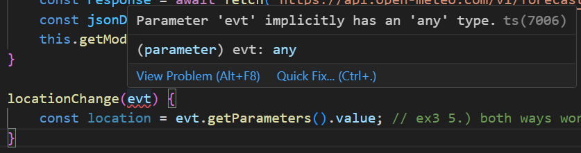
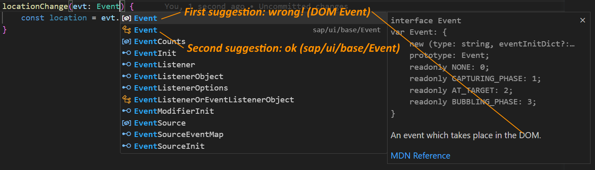
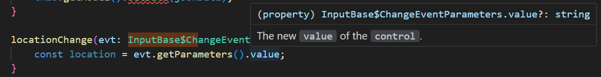
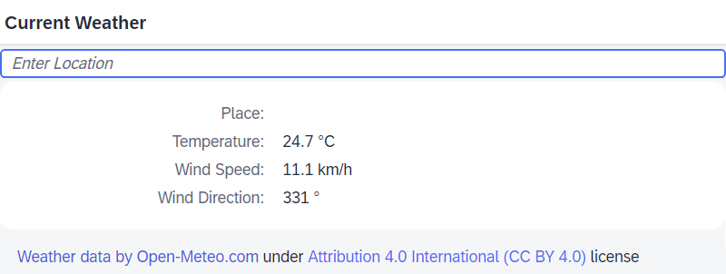

# Exercise 3 - React on User Input

In this exercise, you will handle user input (to change the location for the displayed weather) and learn how TypeScript helps with handling events.

## Exercise 3.1 - Extend the View with Location Fields

After completing this section, the view will have an input field for entering the location and a text in the Form to display the resolved location. 

1. Open the file `webapp/view/Main.view.xml` and insert an Input control before the opening `<form:SimpleForm>` tag.
	```xml
		<Input change=".locationChange" placeholder="Enter Location" />
	```

2. Inside the SimpleForm, at its beginning, enter a label and a Text for displaying the resolved location. 
	```ts
					<Label text="Place" />
					<Text text="{/placeName}" />
	```

	> This will be useful for verifying that the entered location has been interpreted correctly: the user enters a location as text, but this text will be converted to geographic coordinates before querying the weather service. As there might be multiple places with the same name, the actually resolved coordinates might not be the intended ones, but the returned location description should make such cases easy to detect.

## Exercise 3.2 - Let the Controller React on Location Input by Fetching new Weather Data and Updating the View

1. In the `webapp/controller/Main.controller.ts` file, implement the event handler which will be called when the value in the Input has changed. Insert the following method inside the `Main` class body, e.g. after the `loadWeatherData` method.
	```ts
		locationChange(evt) {
			const location = evt.getParameters().value;
		}
	```
	The returned location will be handled in the next exercise.

2. Now a TypeScript error is displayed in the code editor: *"Parameter 'evt' implicitly has an 'any' type."*

	

	> Whether this is considered an error can be controlled by the `noImplicitAny` setting in the `tsconfig.json` file.

	This means TypeScript cannot reasonably infer the type of this parameter and hence makes the type `any`,  which means no typing, no type check, no content assist, nothing. Basically "make it like JavaScript". Not only this variable but everything derived from it. This is why you should assign a type to method parameters and indeed this is one of the situations where you'll most often deal with explicitly adding type information.

	> There is a "Quick Fix" for this error offered as well (*Infer parameter types from its usage*), but this does not try to find matching predefined types, but it rather *defines* a new type which would allow the subsequent usage. In this case, `evt` would be typed as "an object with a 'getParameters' method that returns an object with 'value' property" (`{ getParameters: () => { (): any; new(): any; value: any; }; }`). This can be used for narrowing down the usage but is not helpful for our case where we want to ensure that only existing event parameters from the actual UI5 API are used and correctly typed.

	To fix this error, assign the type of the Input's "Change" event - actually it is defined inside [`InputBase`](https://sdk.openui5.org/api/sap.m.InputBase#events/change) - to the `evt` parameter:

	```ts
	locationChange(evt: InputBase$ChangeEvent) {
	```

	> :tada: **NEW**: Those event types are composed of the control name and the event name, separated by a dollar sign. They are available from UI5 types version 1.115.1 (June 2023).

	Use the Quick Fix to import it or add the following line using the *named export* manually to the top of the file:

	```ts
	import { InputBase$ChangeEvent } from "sap/m/InputBase";
	```

	> :warning: **Remark:** Make sure not to accidentally use `Input$ChangeEvent` from the `sap/ui/webc/main/Input` control!

	> :warning: **Remark:** If you are not interested in using parameters from the specific type of event, you could also use the base class `Event`. But be careful to pick the correct `Event` class, as also types for the browser's DOM API are available!
	 
	> The same can e.g. happen for a DOM `Element` vs. UI5's `sap/ui/core/Element`.

	Now when hovering `value`, you see that TypeScript knows this event parameter and its type.

	

4. (**OPTIONAL** / alternatively) Although it makes no sense in *this* case, it sometimes is required to attach event handlers dynamically in controller code. E.g. in `onInit` one could do the following.

	```ts
			const input = this.byId("locationInput");
			if (input.isA<Input>("sap.m.Input")) { // type guard (unfortunately the control class needs to be given twice)
				input.attachChange(function(evt) { // now TS knows input is an Input
					const location = evt.getParameter("value"); // type safety even for string-based access
				});
			}
	```

	To make this work, the ID "locationInput" needs to be assigned to the Input in the XML view.
	As TypeScript does not know the type of the control returned by `this.byId(...)`, it needs to be informed about it. This could be done with a type cast, but also with a so-called "type guard" as seen in the second line: the `isA` method of UI5 uses generics in a way that informs TypeScript that `input` is of type `Input` when the function returns `true`. The type name being checked unfortunately has to be written twice: the string parameter is used by UI5 at runtime, the generics type is used by TypeScript at development time (and is no longer present at runtime).

	> :tada: **NEW**: The possibility to use `.isA(...)` as type guard has been added in March 2023 in version 1.112.


The app now displays the additional input field and form field, but does not do anything visible yet when a location is entered.



## Summary

You've now extended the application UI with a location input field and learned about TypeScript:

* how to assign a type to a method parameter
* how to use the UI5 event related types
* that browser DOM types are also available and there's the risk of picking the wrong one
* how to use the `isA<...>(...)` type guard.

Next, you will react on the location input by finding out the respective geographic coordinates and showing the weather for this location.

Continue to - [Exercise 4 - Use Third-Party NPM Packages](../ex4/README.md)
