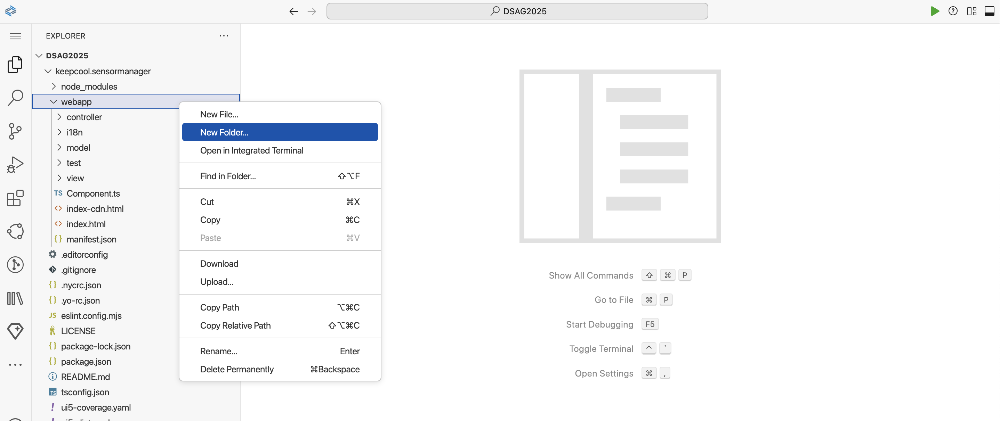
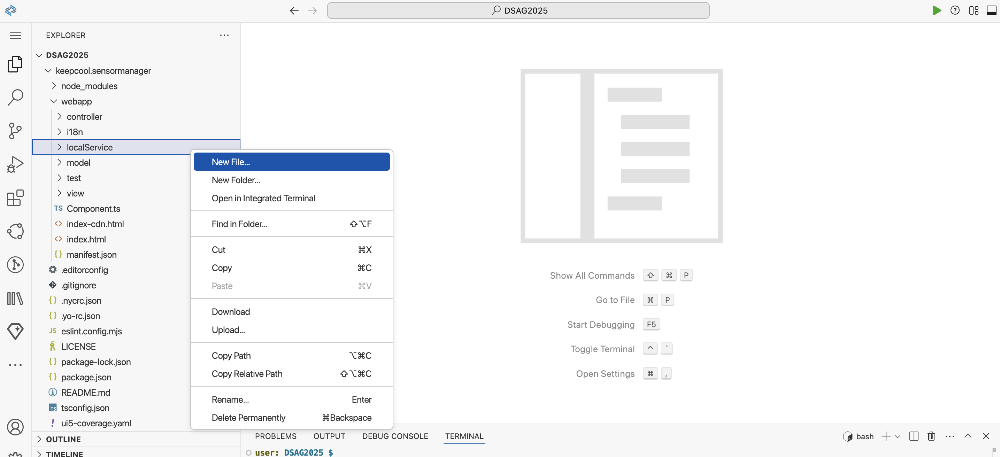
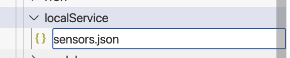
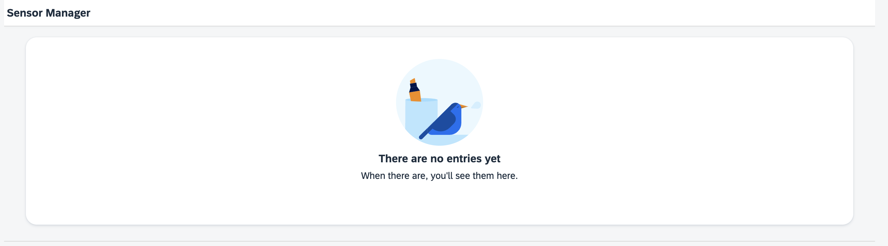
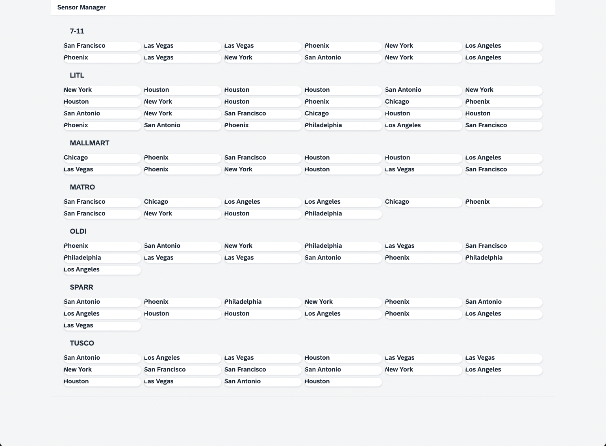

[](sensormanager)
# Exercise 3 - Show Sensor Content

In this exercise you'll add a local data service to the application and display the data on the enhanced UI5 view.

## Exercise 3.1 - Import Sensor Data

To simulate a source providing sensor data, you'll now add some sensor data to your application.

1. Rightclick on the `sensormanager/webapp/` folder and select *New Folder*.
<br><br><br><br>

2. Enter *localService* as the folder name.

3. Right-click on the `localService` folder.

4. Select `New File`.
<br><br><br><br>

5. Enter `sensors.json` as file name.
<br><br><br><br>

6. Copy and paste the content of [sensors.json](data/sensors.json) into the newly created file.

## Exercise 3.2 - Configure a Data Service

After adding the sensor data to your application, you'll need to configure the data service which provides the sensor data.

1. Open the `manifest.json` file. You can find the `manifest.json` file located under `keepcool.sensormanager/webapp/`.

2. Go to the section `sap.app`. Here, replace the `dataSources` section as follwowing:

	***keepcool.sensormanager/webapp/manifest.json***

	````js
		"sap.app": {
			...
			"dataSources": {
				"sensorSource": {
					"type": "JSON",
					"uri": "./localService/sensors.json"
				}
			}
		}
	````

The `sensorSource`, points to the sensor data which has just beed added to the `localService` folder.

3. Go to the section `sap.ui5`. Here, replace the `models`section as following:

	***keepcool.sensormanager/webapp/manifest.json***

	````js
		"sap.ui5": {
			...
			"models": {
				"i18n": {
					"type": "sap.ui.model.resource.ResourceModel",
					"settings": {
						"bundleName": "keepcool.sensormanager.i18n.i18n",
						"async": true
					}
				},
				"sensorModel": {
					"type": "sap.ui.model.json.JSONModel",
					"dataSource": "sensorSource"
				}
			},
	````

The `JSONModel` with name `sensorModel` is defined here which will serve as the central datapoint in the application.
Note that this model is referencing the data source that has been created prior to the model.

## Exercise 3.3 - Add a GridList

After configuring the data service, it's now time to enrich your `Sensors.view.xml` with some fancy UI5 controls!

1. Open the `ui5.yaml` file located under `keepcool.sensormanager/`.

2. Add `sap.ui.layout` to the `framework/libraries` section.

	```yaml
	framework:
	...
	libraries:
		- name: sap.ui.layout
		- name: sap.f
		- name: sap.m
		- name: sap.ui.core
		- name: themelib_sap_horizon
	```

3. Now open the `Sensors.view.xml` located under `keepcool.sensormanager/webapp/view/`.

4. Add `sap.f` and `sap.ui.layout.cssgrid` to the xml namespace declarations to make sure that the required resources are available in your view.

	***keepcool.sensormanager/webapp/view/Sensors.view.xml***

	````xml
	<mvc:View
		controllerName="keepcool.sensormanager.controller.Sensors"
		xmlns:mvc="sap.ui.core.mvc"
		xmlns="sap.m"
		xmlns:grid="sap.ui.layout.cssgrid"
		xmlns:f="sap.f"
		displayBlock="true">
	````

5. Add `sap.f.GridList` by replacing the IllustratedMessage control in the `content` aggregation of the IconTabBar. An aggregation is a relation between two UI elements. It is used to define the parent-child relationship within the tree structure. The child end of the relation may have cardinality 0..1 or 0..*. The elements' API offers convenient and consistent methods to deal with aggregations (e.g. to get, set, or remove child elements). Examples are table rows and cells, or the content of a table cell.

	***keepcool.sensormanager/webapp/view/Sensors.view.xml***

	```xml
					<content>
						<f:GridList
							id="sensorsList">
							<f:customLayout>
								<grid:GridBoxLayout/>
							</f:customLayout>
							<f:items>
								<!-- item template will be added here! -->
							</f:items>
							<f:noData>
								<IllustratedMessage
									enableVerticalResponsiveness="true"
									illustrationType="sapIllus-EmptyList"/>
							</f:noData>
						</f:GridList>
					</content>
	```

6. Switch browser tabs and refresh to see the updated UI5 application.
<br><br><br><br>

## Exercise 3.4 - Add Data Binding

After adding the `sap.f.GridList` control, you'll need to connect the control to the sensor data. For this, UI5 provides a mechanism called *Data Binding*.

1. Open the `Sensors.view.xml` located under `keepcool.sensormanager/webapp/view/`.

2. Bind the `items` aggregation of the `sap.f.GridList` to the path `sensorModel>/sensors`. Here, `sensorModel` is  the name of your recently defined data model, and `/sensors` points to a property inside it. As this is an array with several entries, you'd probably like to define sorting and grouping as well. In the `sorter` you can configure this by using the properties available:

	***keepcool.sensormanager/webapp/view/Sensors.view.xml***

	````xml
						<f:GridList
							id="sensorsList"
							items="{
								path: 'sensorModel>/sensors',
								sorter: {
									path:'customer',
									group:true,
									descending: false
									}
								}">
	````

3. The list items are defined once as a template, which is then repeated multiple times to represent each entry of the sensors array. We also add some location details to our `sap.m.CustomListItem`. Here, `location` references the location property of each of the displayed sensor items. Replace the comment `<!-- item template will be added here!>` with the following template:

	***keepcool.sensormanager/webapp/view/Sensors.view.xml***

	````xml
								<CustomListItem>
									<Title text="{sensorModel>location}"/>
								</CustomListItem>
	````

4. Let's see if our UI5 application displays the correct sensor data. Switch to the browser tab with the opened application preview and reload the page.
<br><br><br><br>

## Summary

Congratulations! You've completed successully [Exercise 3 - Show Sensor Content](#exercise-3---show-sensor-content).

Continue to [Exercise 4 - Improve Visualization](../ex4/README.md).

## Further Information

* Data Binding: https://ui5.sap.com/#/topic/68b9644a253741e8a4b9e4279a35c247
