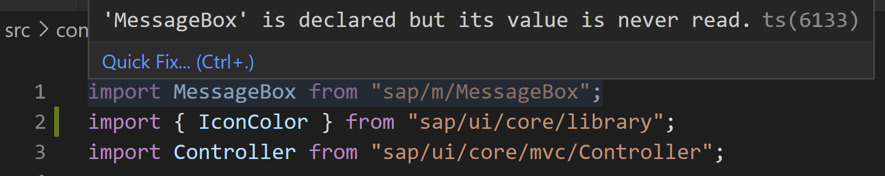
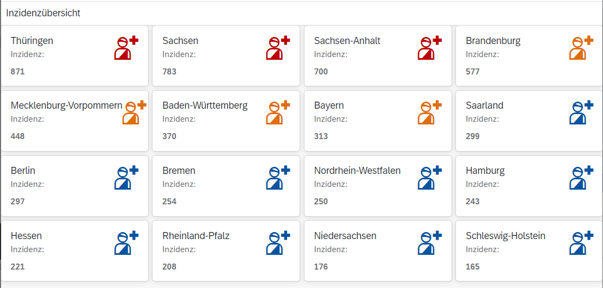

# Exercise 4 - Enhance the User Interface and Use Formatters

In this exercise, you will enhance the user interface to display data and add formatter functions to the controller.

## Exercise 4.1 Add Formatter Functions to the Controller

After completing these steps, you will have added two formatters to the controller.

1. In the `src/controller/Main.controller.ts` file, replace the `sayHello` method inside the class body, which is left over from the initial template, with two formatter functions:

	```ts
		formatIncidence(incidence: number) {
			return Math.round(incidence);
		}

		formatIconColor(incidence: number) {
			if (incidence < 500) {
				return IconColor.Default;
			} else if (incidence < 800) {
				return IconColor.Critical;
			} else {
				return IconColor.Negative;
			}
		}
	```

	The `IconColor` enum is not available in this module yet, so it needs to be imported as described in exercise 2, e.g. by using the "Quick Fix..." in the error popup. In the end, you should have the following import line:
	```ts
	import { IconColor } from "sap/ui/core/library";
	```

	The code of both methods is standard JavaScript, except the `...: number` type declaration for the `incidence` parameters. Only these parts are TypeScript syntax - and required: without them, the TypeScript compiler would display an error message saying that the type is not known and hence implicitly "any".

	Like all formatters in UI5, they get a raw value from the model and convert it to the value used in the UI. In the first case this happens by rounding, as the original data has a large number of decimals. In the second case by returning a color depending on the incidence.

	> :warning: **Remark:**
	You might need to adjust the incidence thresholds (which are hardcoded in this code snippet) in order to see all three colors.
2.	Depending on your editor (automatically or when hovering the MessageBox import) or when running a lint check (explained later), you are warned that the MessageBox is no longer used.

	

	You can remove this import, either manually or using the Quick Fix offered in the tooltip.

## Exercise 4.2 Extend the View to Show Incidence Numbers per State and Colored Icons

After completing these steps, you will have extended the View to display colored icons and to display incidence numbers rounded by the just created formatter function.

1.	In `src/view/Main.view.xml`, add the following attribute to the root element at the top. This declares the needed namespace for the Icon control from the core library.

	```js
		xmlns:core="sap.ui.core"
	```

2.	In the same file `src/view/Main.view.xml`, add the following attribute to the `<f:GridList...` element. This adds a nice padding around the items.

	```js
	class="sapUiContentPadding"
	```

3.  In the same file `src/view/Main.view.xml`, replace the `<CustomListItem>...</CustomListItem>` part with the following content.

	```xml
						<CustomListItem type="Active">
							<HBox justifyContent="SpaceBetween" class="sapUiSmallMargin">
								<Title text="{name}" wrapping="true"/>
								<core:Icon 
									src="sap-icon://wounds-doc" 
									size="2.5rem" 
									color="{path: 'weekIncidence', formatter: '.formatIconColor'}"/>
							</HBox>
							<HBox justifyContent="SpaceBetween" class="sapUiSmallMargin">
								<Label text="{i18n>incidenceLabel}:"/>
								<ObjectNumber number="{path: 'weekIncidence', formatter: '.formatIncidence'}"/>
							</HBox>
						</CustomListItem>
	```

	Most of the code is just for layouting and not important for the scope of this tutorial. The `{path: 'weekIncidence', formatter: '.formatIncidence'}` data binding configuration for the `<ObjectNumber>` close to the end is binding the "weekIncidence" of the German state to which the respective CustomListItem belongs and is declaring that the value should be modified by the `formatIncidence` function you defined above. 

	Similarly, the icon color is bound to the weekly incidence, through the second formatter defined above, which calculates the color from the incidence value.

When you look at the running app now, the icons are colored depending on the local incidence level.

## Summary

You've now extended the view and added formatters to the controller which are used for formatting the number and defining the icon color.


> :warning: **Remark:** this screenshot is not adapted to current incidences and coloring thresholds.

Continue to - [Exercise 5 - Create a Second View](../ex5/README.md)
