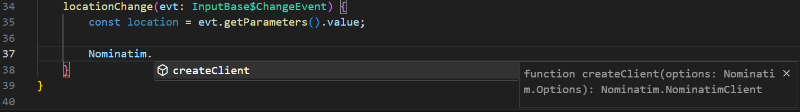
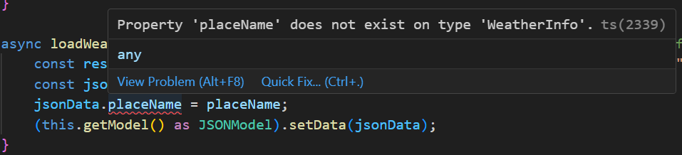
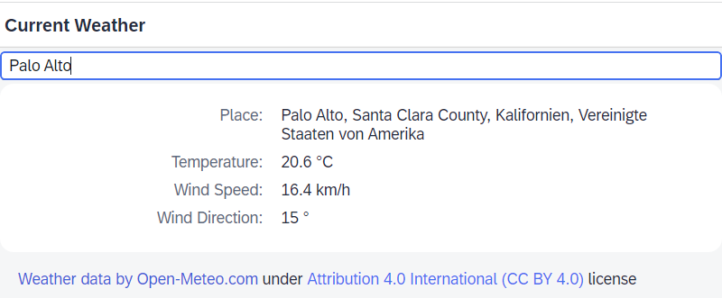

# Exercise 4 - Use Third-Party NPM Packages

In this exercise, you will resolve the given location name to geographic coordinates and load weather data for those coordinates.
Doing so, you will learn how to use front-end NPM packages in a typed manner directly from `node_modules`, thanks to the `ui5-tooling-modules` extension for the UI5 tooling. It gives you the following benefits:

* Configuration-free consumption of project dependencies (e.g. not more than `npm i nominatim-client`)
* Importing the dependency in the code with the NPM package name (e.g. `import * as Nominatim from "nominatim-client";`)
* Transpiling of arbitrary module formats into UI5 AMD-like modules

If you are interested in the different module formats, you can find more details about the different module formats here: [CommonJS vs AMD vs RequireJS vs ES6 Modules](https://medium.com/computed-comparisons/commonjs-vs-amd-vs-requirejs-vs-es6-modules-2e814b114a0b).

> :warning: **Remark:**
> This solution may not work for all kinds of NPM packages. The NPM packages should be *frontend* packages. This means they should be capable to run in a browser environment and not rely on all the NodeJS APIs being available. Maybe in the future the rollup configuration could be even customized to allow even more. Right now it is just using a predefined set of rollup plugins to bundle the NPM packages.

## Exercise 4.1 - Install/Configure UI5 Tooling Extensions

To be able to consume NPM packages directly you need to install a [custom task](https://sap.github.io/ui5-tooling/pages/extensibility/CustomTasks/) and a [custom middleware](https://sap.github.io/ui5-tooling/pages/extensibility/CustomServerMiddleware/) to your project. The custom task takes care to create a bundle for the NPM package when building your application and the custom middleware is used during development to generate the NPM package bundle on request.

First you need to install the NPM package providing both `ui5-tooling-modules` extensions as dev dependency to your project:

```sh
npm install ui5-tooling-modules --save-dev
```

Afterwards, you need to enhance the `ui5.yaml` file and add the `ui5-tooling-modules-task` as the **first** custom task to the `builder` > `customTasks` section. Then, add the `ui5-tooling-modules-middleware` as the **first** custom middleware to the `server` > `customMiddleware` section. The order of the tooling extensions matters. The processing order of the tooling extensions added after a task or a middleware is reverse.

> :warning: **Remark:**
> Make absolutely sure the indentation is correct! It needs to be like for the previous items!

```yaml
  specVersion: '2.0'
  […]
  builder:
    customTasks:
    - name: ui5-tooling-modules-task
      afterTask: replaceVersion
      configuration:
        addToNamespace: true
    […]
  server:
    customMiddleware:
    - name: ui5-tooling-modules-middleware
      afterMiddleware: compression
    […]
```

This will execute the custom task after the `replaceVersion` task and add the custom middleware after the `compression` middleware.

The option `addToNamespace` of the `ui5-tooling-modules-task` ensures that the used NPM package is moved into the thirdparty folder of the current projects' namespace. This option has three advantages: resources are project-local, no `resourceRoots` mapping is needed, and the NPM package is included in the preload bundle.

After this step, the `ui5.yaml` should look like this: [`ui5.yaml`](com.myorg.myapp/ui5.yaml).

Now we are able to consume front-end NPM packages directly from `node_modules` after they have been added as project dependencies.

> :tada: **NEW**: previously, there was more configuration required for `ui5-tooling-modules`; this has been simplified in the first half of 2023.

## Exercise 4.2 - Adding/Testing the NPM package `nominatim_client`

1. A free resolution of place names to coordinates is offered by the "Nominatim" service of [OpenStreetMap (OSM)](http://openstreetmap.org/). One of the JavaScript clients for this service is the [nominatim-client](https://www.npmjs.com/package/nominatim-client). So now install this NPM package as dev dependency. Normally dev dependencies are those only needed at development time - they are not bundled with the application. In this case, however, the bundling is done by the `ui5-tooling-modules`, so having such third-party libraries as dev dependency is sufficient.

	```sh
	npm install nominatim-client --save-dev
	```

	Now you can verify whether the custom middleware works fine or not by running the development server with `npm start` (re-start it, if it was already running before the above changes!) and trying to open the nominatim-client file from [http://localhost:8080/resources/nominatim-client.js](http://localhost:8080/resources/nominatim-client.js). You should see the code of the library, nicely wrapped in a `sap.ui.define(...)` statement for a UI5-compatible module definition.

	> Actually, the "Open Meteo" weather service would also allow sending a place name instead of coordinates, but we want to show how to use other libraries.

2. While this works well when loading UI5 from localhost, it will fail when loading UI5 from `https://sdk.openui5.org/1.115.1/resources/sap-ui-core.js` in `index-cdn.html`: as always, UI5 resolves modules by default relatively to UI5 itself, so it tries to load Nominatim from `https://sdk.openui5.org/1.115.1/resources/nominatim-client.js`, which of course does not exist.

	Therefore, in `webapp/index-cdn.html`, in addition to the application resourceRoots, add the following setting: `"nominatim-client": "resources/nominatim-client"`. As result this section should look as follows:

	```
			data-sap-ui-resourceroots='{
				"com.myorg.myapp": "./",
				"nominatim-client": "./resources/nominatim-client"
			}'
	```

	Make sure to get all the quotes and commas right!

	> :warning: The `resourceRoots` are only necessary in the development scenario. With the option `addToNamespace` the `resourceRoots` mapping isn't necessary anymore but as the NPM package is available under a different namespace the mapping doesn't really hurt.


## Exercise 4.3 - Using `nominatim-client` in the Controller

1. Open the file `webapp/controller/Main.controller.ts` and import all exports from `nominatim-client` by adding the following line to the list of imports at the top.

	```ts
	import * as Nominatim from "nominatim-client";
	```

	The library is now available in the controller and we can start using it. Further down, in the `locationChange` method, after getting the location from the event parameters, start typing "Nominatim." and the editor will suggest using the `createClient(...)` method.

	

	This means the type definitions for this library have automatically been found!<br>
	It's because the `nominatim-client` comes with type definitions inside the package (in `node_modules/nominatim-client/index.d.ts`) and the `"types": "index.d.ts"` entry in its `package.json` points to them.

	Other libraries might come without type definitions included, but often they are provided via Microsoft's [DefinitelyTyped](https://github.com/DefinitelyTyped/DefinitelyTyped) in the NPM namespace `@types`. In those cases you usually do something like `npm install @types/LIBRARYNAME --save-dev` to get the type definitions (in addition to installing the library itself). 

	> :warning: **Remark:**
	> To make TypeScript look for type definitions also in node modules (`nominatim-client` is such a module coming with its type definitions), `"moduleResolution": "node"` must be set in `tsconfig.json`. This setting is already present in the app template, so you don't need to do it for this tutorial, but keep it in mind.<br>In some cases it also may be required to modify the `"types"` setting or add a `"typeRoots"` setting in `tsconfig.json`.

2. Now complete the usage of the `nominatim-client` by implementing the `locationChange` method like this:

	```ts
		locationChange(evt: InputBase$ChangeEvent) {
			const location = evt.getParameters().value;

			Nominatim.createClient({
				useragent: "UI5 TypeScript Tutorial App", // useragent and referrer required by the terms of use
				referer: "https://localhost"
			}).search({q: location}).then((results) => {
				if (results.length > 0) {
					this.loadWeatherData(results[0].lat, results[0].lon, results[0].display_name); // for simplicity just use the first/best match
				} else {
					MessageBox.alert("Location " + location + " not found", {
						actions: MessageBox.Action.CLOSE // enums are now properties on the default export!
					});
				}
			});
		}
	```

	The results are - as the editor shows on hovering - also nicely typed and of type `Nominatim.SearchResultItem[]`. The structure of this type can be inspected in detail in `node_modules/nominatim-client/index.d.ts`. We are interested in the resolved coordinates `lat`/`lon` and the place name belonging to them: `display_name`. As an array of such results is returned, we blindly use the first entry, which should be the most likely hit, or display a message box when the result is empty.

	> :tada: **NEW**: The `MessageBox.Action.CLOSE` action has been explicitly used to get the non-default "Close" button, in order to demonstrate how enums in controls are accessible in UI5 with TypeScript: they are properties of the module's default export since version 1.115.0 (June 2023).

3. The `loadWeatherData` method only took two parameters so far, now add the `placeName` as third one, defaulting to "Walldorf". For the easiest possible way to get it displayed, we simply add it to the data in the model, so the already added field in the view can pick it up as if it were part of the original weather data.

	```ts
		async loadWeatherData(lat = "49.31", lon = "8.64", placeName = "Walldorf") { // default coordinates: Walldorf
			const response = await fetch(`https://api.open-meteo.com/v1/forecast?latitude=${lat}&longitude=${lon}&current_weather=true`);
			const jsonData = await response.json() as WeatherInfo;
			jsonData.placeName = placeName;
			(this.getModel() as JSONModel).setData(jsonData); 
		}
	```

	This is a bit hacky - one needs to be careful about the lifecycle of the model data and this property. On the other hand this nicely demonstrates how due to the `WeatherInfo` type, which we defined before, TypeScript now complains about accessing a property which does not exist! This also helps you when you accidentally mis-spell a property name or use uppercase instead of lowercase letters.

	

	Add the `placeName` string property to the custom type to fix the error. It should then look as follows.

	```ts
		type WeatherInfo = {
			current_weather: {
				temperature: number,
				windspeed: number,
				winddirection: number
			},
			placeName: string
		}
	```


Now, when entering a different location, like "Palo Alto", in the input field and pressing *Enter*, the weather data for Palo Alto is loaded and the place name "*Palo Alto, Santa Clara County, Kalifornien, Vereinigte Staaten von Amerika*" is displayed, reassuring you that the correct Palo Alto is being used.



## Summary

You've now integrated the NPM package `nominatim-client` into your UI5 TypeScript application and used it to resolve location coordinates. In this chapter you learned how you can easily add other JS libraries in a modern fashion by simply installing the NPM package and using them in your UI5 application with a simple `import` statement. The additional benefits of TypeScript often come for free for such libraries, or you just need to add the type definitions for the used JS library as additional dev dependency.

Furthermore, you have seen how to access enums belonging to controls and how TypeScript complains when you access a property which does not exist.

Next, display the wind information more nicely in [Exercise 5 - Create and Use a Custom Control](../ex5/README.md)
