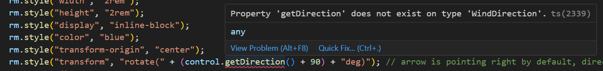
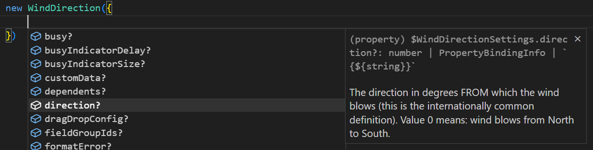

# Exercise 5 - Create and Use a Custom Control

In this exercise, you will create a custom UI5 control in TypeScript and use it to display the wind direction in a nicer way (as an arrow).

## Exercise 5.1 - Create the Custom Control(s)

After completing these steps you will have created a custom control in TypeScript.

1. Inside `webapp`, next to the `controller` directory, create a new directory named `control`.

	> :warning: **Remark:** make sure to create this directory in the correct location, as direct child of `webapp`! Otherwise the app will no longer come up and the browser console will display a failed attempt to load `com/myorg/myapp/control/WindDirection.js`!

2. Inside this new `control` directory, create a new file named `WindDirection.ts` with the following content.<br>

	```ts
	import Control from "sap/ui/core/Control";
	import RenderManager from "sap/ui/core/RenderManager";
	import type { MetadataOptions } from "sap/ui/core/Element";

	/**
	 * @namespace com.myorg.myapp.control
	 */
	export default class WindDirection extends Control {

		static readonly metadata: MetadataOptions = {
			properties: {
				/**
				 * The direction in degrees FROM which the wind blows (this is the internationally common definition). Value 0 means: wind blows from North to South. 
				 */
				"direction": "float"
			}
		}

		renderer = {  
			apiVersion: 2,
			render: (rm: RenderManager, control: WindDirection) => {
				rm.openStart("div", control);
				rm.style("font-size", "2rem");
				rm.style("width", "2rem");
				rm.style("height", "2rem");
				rm.style("display", "inline-block");
				rm.style("color", "blue");
				rm.style("transform-origin", "center");
				rm.style("transform", `rotate(${control.getDirection() + 90}deg)`); // arrow is pointing right by default, direction 0 means blowing FROM the north, so the arrow has to point down
				rm.openEnd();
				rm.text("➢");
				rm.close("div");
			}
		}
	}
	```

	This is an extremely simple control with just one numeric property named "direction". The renderer code is the same as it would be in pure JavaScript (actually most of the file is). It simply renders an Unicode arrow inside a `div` and applies some CSS. Most of it is static and might be separated out into a stylesheet in productive code instead of being written to the HTML of every control instance. Only the rotation value is dynamic and *has* to be written in the renderer.
	
	Note that the control metadata defining the properties etc. is written as a static readonly property in this class syntax.

	Apart from the typing of the `render` method parameters, the only - and most significant - usage of TypeScript is typing the metadata object as `MetadataOptions`, which is a named export of the `sap/ui/core/Element` module:
	```ts
	import type { MetadataOptions } from "sap/ui/core/Element";
	...
	static readonly metadata: MetadataOptions = {
	```
	Note that other base classes have a different metadata structure! Hence `MetadataOptions` is also a named export of `sap/ui/base/Object`, `sap/ui/base/ManagedObject` and `sap/ui/core/Component`. Always make sure to use the correct one!

	> :tada: **NEW**: The `MetadataOptions` types are provided since version 1.110 (January 2023). With earlier versions of the UI5 type definitions, you should use the type `object` instead. It does not provide any typing, but still prevents the issues when your control is inherited from.

	Also note that, as nothing else is imported from the `sap/ui/core/Element` module, TypeScript's `import type` statement can be used, which leaves zero footprint at runtime and is meant for pure type imports.

	> :warning: **Remark:** There is a TypeScript error for `control.getDirection()`, but you'll deal with it later.

## Exercise 5.2 - Use the New Control in the UI

After completing this step, the wind direction will be visualized with an arrow.

1.  In `webapp/view/Main.view.xml`, add the custom control namespace (let's choose the name "cc") to the list of namespaces in the root tag.
	```xml
	xmlns:cc="com.myorg.myapp.control"
	```

2. Then use the new WindDirection control by inserting this block into the SimpleForm, e.g. below the existing wind direction block.
	```xml
					<Label text="Wind Visualization" />
					<cc:WindDirection direction="{/current_weather/winddirection}" />
	```
 
When running the app, the UI now shows an arrow pointing into the same direction as the wind blows (assuming North is up).

## Exercise 5.3 - Generate Control Interfaces to Resolve the TypeScript Error

While the application does run successfully, the editor still displays an error in the `WindDirection.ts` renderer where it says `control.getDirection()` because this method does not exist from TypeScript perspective.



Indeed this method, like all accessors to properties, aggregations, events etc. of UI5 controls, is generated by the UI5 framework at *runtime*, so TypeScript *cannot know* about it at development time.

The solution is to use a small [tool provided by the UI5 team](https://www.npmjs.com/package/@ui5/ts-interface-generator), which scans the project for any controls (as well as other subclasses of `sap.ui.ManagedObject`) and generates TypeScript interface definitions declaring those generated methods.

To use this tool:

1. Open the `com.myorg.myapp` directory (the root directory of the application) in a terminal window (in Visual Studio Code you can simply select the menu entry `Terminal` > `New Terminal` to do so) and enter the following command:

	```sh
	npm install @ui5/ts-interface-generator --save-dev
	```

2.  Once the command has completed, enter the following command:

	```sh
	npx @ui5/ts-interface-generator --watch
	```

	This starts the interface generator tool in "watch" mode and creates the required interface definition (after a short startup delay during which all existing types in the project and in UI5 are scanned).

	You can inspect the generated file [`webapp/control/WindDirection.gen.d.ts`](com.myorg.myapp/webapp/control/WindDirection.gen.d.ts) next to the control implementation. It defines an interface with the same name as the control class and declares the same module name. This causes [TypeScript to merge the definitions](https://www.typescriptlang.org/docs/handbook/declaration-merging.html) and to assume that the interface methods also exist in the class. 

	As a result, the TypeScript error message is gone and code completion is also available for all control API methods.

	You can now stop the interface generator again, as no further control API changes will be done in this tutorial. For continuous control development with frequent API changes, you would likely add a "watch" script to package.json for starting this generator.

3.  To complete the setup of the generated interface, follow the instructions found in the console output of the interface generator. It says:

	```
	NOTE:
	Class WindDirection in file .../com.myorg.myapp/webapp/control/WindDirection.ts needs to contain the following constructors, in order to make TypeScript aware of the possible constructor settings. Please copy&paste the block manually, as the ts-interface-generator will not touch your source files:
	===== BEGIN =====
	// The following three lines were generated and should remain as-is to make TypeScript aware of the constructor signatures
	constructor(idOrSettings?: string | $WindDirectionSettings);
	constructor(id?: string, settings?: $WindDirectionSettings);
	constructor(id?: string, settings?: $WindDirectionSettings) { super(id, settings); }
	===== END =====
	```

	So add the block *between* the BEGIN and END line into the `WindDirection` class body in the file `webapp/control/WindDirection.ts`.

	This provides the constructors and the structure of the constructor settings object. As result, the constructor signatures with and without control ID are available. Furthermore, TypeScript checks the settings you give in the constructor and suggests the available ones, like the `direction` property.

	

	> :tada: **NEW**: This also shows that the JSDoc written for the `direction` property is reflected in the generated types (also in the setter and getter). This works since version 0.6.0 of the `ts-interface-generator` (May 2023).

## Summary

You've now implemented a custom control in TypeScript and made it appear in the app.

While doing so, you have seen how to write down the control code including its `metadata` object in JavaScript class syntax using TypeScript. Furthermore, you have seen how a tool provided by the UI5 team assists by declaring the API methods for TypeScript and how this uses TypeScript's *declaration merging*.

Continue to [Exercise 6 - Testing](../ex6/README.md) to learn how to write unit tests and OPA tests in TypeScript.
