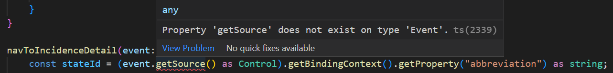
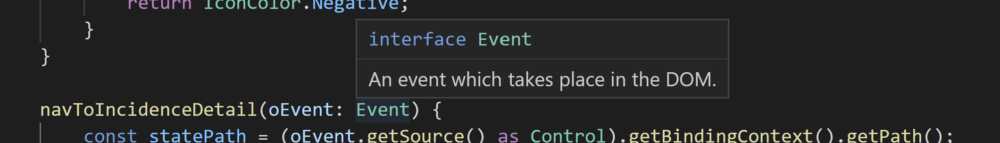

# Exercise 5 - Create a Second View

In this exercise, you will create a second view for incidence history details and set up the routing and event handlers to allow navigation between the views.


1.  In the `src/manifest.json` file, find the `routing` > `routes` section and add the following entry to the list. Don't forget adding a comma after the previous entry!

	```json
					{
						"name": "IncidenceDetailRoute",
						"pattern": "state/{id}",
						"target": ["IncidenceDetailTarget"]
					}
	```

	The route pattern matches a URL hash like `#/state/NW` where `NW` is the ID of the German state "Nordrhein-Westfalen" (North Rhine-Westphalia). By declaring this hash pattern, you will be able to read the selected state ID from the route's `matched` event parameters, so you can display the correct data.

	As result, the `routes` section should look like this:
	```json
				"routes": [
					{
						"pattern": "",
						"name": "main",
						"target": "main"
					},
					{
						"name": "IncidenceDetailRoute",
						"pattern": "state/{id}",
						"target": ["IncidenceDetailTarget"]
					}
				],
	```
	Make sure not to forget a comma after the previous entry.

2.  In the same `manifest.json` file find the `routing` > `targets` section and add the following entry to the list.

	```json
					"IncidenceDetailTarget": {
						"viewId": "incidenceDetail",
						"viewName": "IncidenceDetail",
						"viewLevel": 2
					}
	```

	This is the target specified by the above route and defines which view should be displayed.

	As result, the `targets` section should look like this:

	```json
				"targets": {
					"main": {
						"viewId": "main",
						"viewName": "Main"
					},
					"IncidenceDetailTarget": {
						"viewId": "incidenceDetail",
						"viewName": "IncidenceDetail",
						"viewLevel": 2
					}
				}
	```

3. In the `src/view` directory, create a new file named `IncidenceDetail.view.xml` with the following content:

	```xml
	<mvc:View
		displayBlock="true"
		xmlns:mvc="sap.ui.core.mvc"
		xmlns="sap.m"
		controllerName="com.myorg.myapp.controller.IncidenceDetail">
		<Page
			id="incidenceDetailPage"
			title="tbd"
			showNavButton="true"
			navButtonPress=".onNavButtonPress">
		</Page>
	</mvc:View>
	```

	This view consists of an empty `sap.m.Page` control where the "Back"/"Nav" button is shown and triggers a method in the `com.myorg.myapp.controller.IncidenceDetail` controller (which will be created in the next step). The page title will be set in a later exercise, once data is loaded for this view.

4.  In the `src/controller` directory, add a new file named `IncidenceDetail.controller.ts` with the following content:

	```ts
	import Controller from "sap/ui/core/mvc/Controller";
	import History from "sap/ui/core/routing/History";
	import UIComponent from "sap/ui/core/UIComponent";

	/**
	 * @name com.myorg.myapp.controller.IncidenceDetail
	 */
	export default class IncidenceDetail extends Controller {

		onNavButtonPress() {
			const previousHash = History.getInstance().getPreviousHash();
			if (previousHash !== undefined) { // check needs to be like this (!==) because we want to go into this branch when hash is ""
				window.history.go(-1);
			} else { // when user launched the detail page directly, so there is no previous page in this app's history, then explicitly go to the main page
				UIComponent.getRouterFor(this).navTo("main");
			}
		}
	}
	```

	> **Remark:** in case you type the code by hand, make sure to import `sap/ui/core/routing/History`, not `sap/ui/core/History`.<br><br>
	As JSDoc comment, `@name` is used here, giving the full name of the controller. In the controllers generated from the template it was just the `@namespace` without the controller's own name. Both options are equally valid.

	This `onNavButtonPress` method is triggered by the "Back" button and will navigate back to the main page. Either by using the browser's own history API or by explicitly navigating to the main view, when the user has arrived directly at the detail page (e.g. using a bookmark that includes the URL hash for the detail page).

	The `window` type is automatically known to TypeScript - like the entire DOM API - so you get code completion and type checks for calling `history.go(-1)`.


5.  In `src/view/Main.view.xml`, add the attribute `press=".navToIncidenceDetail"` to the `<CustomListItem...` tag to trigger navigation. As result, the line should look like this:

	```xml
	<CustomListItem type="Active" press=".navToIncidenceDetail">
	```


6.  In the file `src/controller/Main.controller.ts`, add the following method. This code gets the ID of the selected state from the binding context of the selected item. In the last code line, you can see how this ID is passed into the router, so it a) becomes part of the URL hash and b) can be read in the detail page.

	```js
		navToIncidenceDetail(event: Event) {
			const stateId = (event.getSource() as Control).getBindingContext().getProperty("abbreviation") as string;
			UIComponent.getRouterFor(this).navTo("IncidenceDetailRoute", { id: stateId });
		}
	```

	Initially, there are TypeScript errors displayed. While solving them, you will learn two more things about TypeScript:

	1. In `(event.getSource() as Control).getBindingContext()`, you see a type cast to the `Control` class. Such a cast is sometimes needed for methods returning a base class (in this case: `sap.ui.base.EventProvider`) when you need to call a method (`getBindingContext()`) which does *not* exist on the base class, but only on a more specific sub-class (`sap.ui.core.Control`). Because the event triggering this method was registered on a `Control` (a `sap.m.CustomListItem`), this cast of the event source is safe.

		There are two ways to write such a type cast. The other one would look like this: `(<Control> event.getSource()).getBindingContext()`. Basically it is a matter of taste which syntax to use - there is no official recommendation or wide-spread agreement. The `<...>` syntax was the original one, but it can easily be confused with the notation of generics, so many prefer the `as ...` syntax which was added to TypeScript later to be usable in JSX contexts.

		Another typecast to `string` is applied at the end of the line because TypeScript does not know the model data structure. 

	2. Importing the `Control` and `UIComponent` classes is possible using the "Quick Fix..." in the error popup, as shown in previous exercises. But after doing so, there is still an error for event.getSource().
	

	At first glance, it's not clear what the problem is. After all, the UI5 "Event" class [does have a "getSource()" method](https://ui5.sap.com/#/api/sap.ui.base.Event%23methods/getSource). Or doesn't it?<br>
	Let's hover with the mouse over the "Event" type specified for the method parameter and you'll understand: TypeScript apparently thinks `Event` refers to the browser DOM event!
	

	As seen with the `window` object above, knowledge about the DOM `Event` type is built-in to TypeScript (note: there is no import for the "Event" type so far!). Due to the name equality, TypeScript assumes the DOM Event class is meant. This is something to keep in mind when dealing with types which have very generic and common names.<br>
	You can simply override by explicitly importing the UI5 Event class. Add the following line to the beginning of the file to get rid of the error:

	```ts
		import Event from "sap/ui/base/Event";
	```

## Summary

You've now created a second view and added event handlers to both views which trigger navigation back and forth. In those event handlers, you have used the routing APIs and the browser's own history API.

In terms of TypeScript, you have learned two things: First, how type casting works and when it is needed. Second, that TypeScript comes with built-in types whose names can clash with the class you actually intend to use - and how to solve this conflict.

Continue to - [Exercise 6 - Load Incidence History Data](../ex6/README.md)
