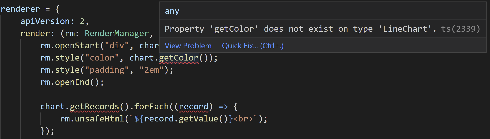
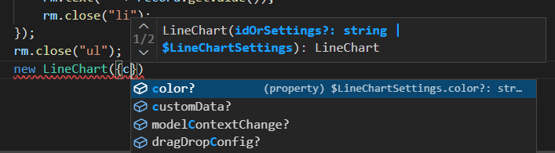

# Exercise 7 - Create and Use a Custom Control

In this exercise, you will create a custom UI5 control in TypeScript and use it in the detail view to display history data.

The control will display a line chart after the *next* exercise. While SAPUI5 contains different powerful chart controls, none of them is part of OpenUI5 - which we are using here. Hence, this is a good example how to add missing functionality.

## Exercise 7.1 Create the Custom Control(s)

After completing these steps you will have created a custom Control (which will draw a chart after the *next* exercise) in TypeScript. In addition, you will also have created a custom Element (representing a single data point).

1. Inside `src`, next to the `controller` directory, create a new directory named `control`.

	> **REMARK**: make sure to create this directory in the correct location, as direct child of `src`! Otherwise the second page of the app will no longer show up and the browser console will display a failed attempt to load `com/myorg/myapp/control/LineChart.js`!

2. Inside this new `control` directory, create a new file named `ChartRecord.ts` with the following content.<br>
It implements an element with the properties `label` and `value`.
	> **Remark:** `sap.ui.core.Element` is a base class of `sap.ui.core.Control` and is typically used for data binding when there is no need to produce HTML (because this can be done by the parent control). Hence, in most cases, elements do not have a renderer, and that's the main difference to a regular control.
	```ts
	import UI5Element from "sap/ui/core/Element";

	/**
	 * @name com.myorg.myapp.control.ChartRecord
	 */
	export default class ChartRecord extends UI5Element {
		static readonly metadata = {
			properties: {
				label: "string",
				value: "float"
			}
		}
	}
	```

	The base class from which to inherit is called `Element`. This can again lead to confusion with the HTML DOM class `Element`. So make sure to import the superclass type `from "sap/ui/core/Element"`. It does not matter how you name the imported type: it could be named `Element`, like you did with `Event` in the previous exercises, but to avoid confusion for readers of the code, one can alternatively also name it `UI5Element`, as done here.

	Note how the class definition is modern JavaScript class syntax, just like used before in the controllers and in `Component.ts`. Here you can also see how to specify the control API metadata as a *static readonly* property.


3.  Inside the `control` directory, create another new file named `LineChart.ts` with the following content.<br>
This is the actual LineChart control, aggregating the previously created ChartRecord data points. In contrast to the `ChartRecord` element, this control also has a renderer. The renderer code is the same as it would be in pure JavaScript. To keep this exercise simple, the renderer just writes all data values separated by linebreaks. This will be enhanced into a real chart in the next exercise.

	```js
	import Control from "sap/ui/core/Control";
	import RenderManager from "sap/ui/core/RenderManager";

	/**
	* @name com.myorg.myapp.control.LineChart
	*/
	export default class LineChart extends Control {

		static readonly metadata = {
			properties: {
				"title": "string",
				"color": "sap.ui.core.CSSColor"
			},
			aggregations: {
				"records": {
					type: "com.myorg.myapp.control.ChartRecord"
				}
			},
			defaultAggregation: "records"
		}

		renderer = {
			apiVersion: 2,
			render: (rm: RenderManager, chart: LineChart) => {
				rm.openStart("div", chart);
				rm.style("color", chart.getColor());
				rm.style("padding", "2em");
				rm.openEnd();

				chart.getRecords().forEach((record) => {
					rm.unsafeHtml(`${record.getValue()}<br>`);
				});

				rm.close("div");
			}
		}
	}
	```

	> **Remark:** There is a TypeScript error for `getColor()`, one for `getRecords()` and one for `record`, but you'll deal with them later.

	> **Remark:** The `unsafeHtml` method has its alerting name to make you as developer aware that only content my be passed in which is guaranteed not to be malicious. Otherwise an attacker could sneak in script code which is executed in the page. In this case, the `value` property of the `ChartRecord` element has type `float`, so UI5 ensures that it can only contain numers - which are safe.<br>
	The argument of this method uses a template string (denoted by backticks instead of quotes), which is modern JavaScript syntax allowing elegant embedding of variables and calculations.

## Exercise 7.2 Use the New Control in the Detail View

After completing this step, the new control will list the incidence history values of the past 100 days on the detail page.

1.  In `src/view/IncidenceDetail.view.xml`, add the custom control namespace (let's choose the name "cc") to the root tag and use the new LineChart control as page content. As result the file should look like this.

	```xml
	<mvc:View
		displayBlock="true"
		xmlns:mvc="sap.ui.core.mvc"
		xmlns="sap.m"
		xmlns:cc="com.myorg.myapp.control"
		controllerName="com.myorg.myapp.controller.IncidenceDetail">
		<Page
			id="incidenceDetailPage"
			title="{incidenceHistory>name}"
			showNavButton="true"
			navButtonPress=".onNavButtonPress">
			<cc:LineChart
					title="{incidenceHistory>name}"
					color="red"
					records="{incidenceHistory>history}">
				<cc:ChartRecord
					label="{incidenceHistory>date}"
					value="{incidenceHistory>weekIncidence}" />
			</cc:LineChart>
		</Page>
	</mvc:View>
	```
	The `records` aggregation of the `LineChart` is bound to the `history` section in the data (within the currently selected state). Each `ChartRecord` represents one of the data points for a day and contains the date as label and the weekly incidence as value.
 
When running the app, the second page now shows a long list of numbers. This list will be turned into a nice line chart later.

## Exercise 7.3 Generate Control Interfaces to Resolve the TypeScript Errors

While the application does run successfully, the code editor still displays errors in the `LineChart.ts` renderer, e.g. where it says `chart.getColor()`and `chart.getRecords()` because these method do not exist.



These methods, like all accessors to properties, aggregations, events etc. of controls, are generated by the UI5 framework at runtime, so TypeScript does not know about it at development time.

The solution is to use a small [tool provided by the UI5 team](https://www.npmjs.com/package/@ui5/ts-interface-generator), which scans the project for any controls (as well as other subclasses of `sap.ui.ManagedObject`, including for example the `Element` you created) and generates TypeScript interface definitions declaring those generated methods.

To use this tool:

1. Open the `com.myorg.myapp` directory (the root directory of the application) in a terminal window (in Microsoft Visual Studio Code you can simply select the menu entry `Terminal` > `New Terminal` to do so) and enter the following command:

	```sh
	npm install @ui5/ts-interface-generator --save-dev
	```

2.  Once the command has completed installing the dependency, enter the following command:

	```sh
	npx @ui5/ts-interface-generator --watch
	```

	This starts the interface generator tool in "watch" mode and creates the required interface definitions after a short startup delay during which all existing types in the project and in UI5 are scanned.

	You can inspect the generated files [`src/control/LineChart.gen.d.ts`](com.myorg.myapp/src/control/LineChart.gen.d.ts) and [`src/control/ChartRecord.gen.d.ts`](com.myorg.myapp/src/control/ChartRecord.gen.d.ts) next to the custom control implementation. They define an interface with the same name as the control class and declare the same module name. This causes TypeScript to merge the definitions and to assume that the interface methods exist in the class. 

	As a result, the TypeScript error messages are gone and code completion is also available for all control API methods.

	You can now stop the interface generator again, as no further control API changes will be done in this tutorial.

3.  To complete the setup of the generated interfaces, follow the instructions found in the console output of the interface generator. It says:

	```
	NOTE:
	Class LineChart in file .../com.myorg.myapp/src/control/LineChart.ts
	needs to contain the following constructors, in order to make TypeScript aware of
	the possible constructor settings. Please copy&paste the block manually,
	as the ts-interface-generator will not touch your source files:
	===== BEGIN =====
	// The following three lines were generated and should remain as-is to make TypeScript aware of the constructor signatures
	constructor(idOrSettings?: string | $LineChartSettings);
	constructor(id?: string, settings?: $LineChartSettings);
	constructor(id?: string, settings?: $LineChartSettings) { super(id, settings); }
	===== END =====
	```

	So add the block *between* the BEGIN and END line into the `LineChart` class body in the file `src/control/LineChart.ts`, then find the respective output for the `ChartRecord` class and copy&paste it to the class body inside the file `src/control/ChartRecord.ts`.

	This provides the constructors and the structure of the constructor settings object. As result, the constructor signatures with and without control ID are available. Furthermore, TypeScript checks the settings you give in the constructor and suggests the available ones, like the `color` property.

	

## Summary

You've now implemented a custom control (plus an element) in TypeScript and made it appear and display data on the detail page.

While doing so, you have seen how a tool provided by the UI5 team assists with developing controls in TypeScript by declaring the API methods to make the TypeScript aware of them.

Continue to [Exercise 8 - Using NPM Packages](../ex8/README.md) to evolve the custom control into a nice-looking line chart.
