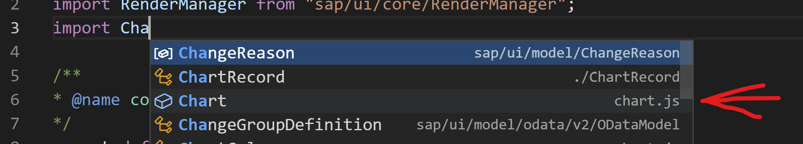
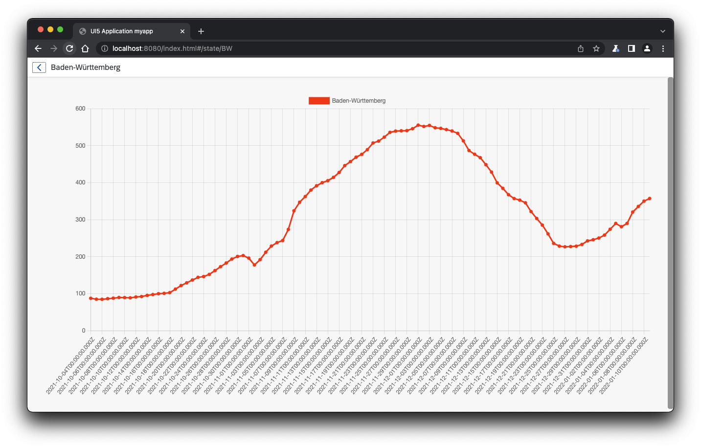
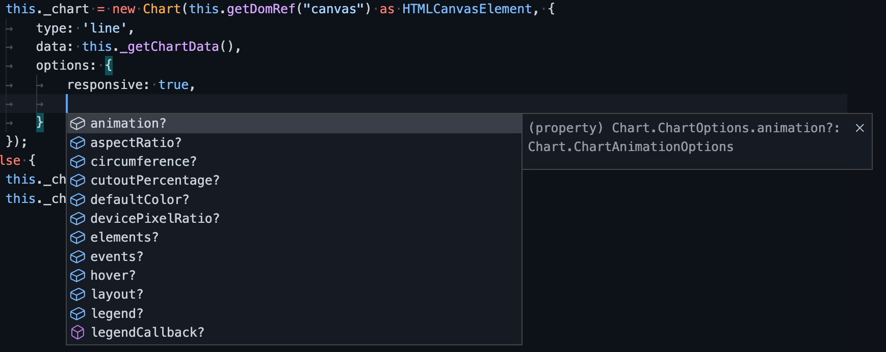

# Exercise 8 - Using NPM Packages

In this exercise, you will learn how to use front-end NPM packages directly from `node_modules` without [project shims](https://sap.github.io/ui5-tooling/pages/extensibility/ProjectShims/).

Shimming of front-end NPM packages requires additional configuration in the `ui5.yaml` and it also doesn't transpile the modules from CommonJS, AMD or ES module format into the UI5 AMD-like syntax using `sap.ui.define` and `sap.ui.require`. In this chapter you will learn how to use UI5 tooling extensions to benefit from the following three features:

* Configuration-free consumption of project dependencies (e.g. `npm i chart.js -D` not more)
* Importing the dependency with the NPM package name (e.g. `import {Chart} from "chart.js";`)
* Transpiling of arbitrary module formats into UI5 AMD-like modules

If you are interested in the different module formats, you can find more details about the different module formats here: [CommonJS vs AMD vs RequireJS vs ES6 Modules](https://medium.com/computed-comparisons/commonjs-vs-amd-vs-requirejs-vs-es6-modules-2e814b114a0b).

> :warning: **Remark:**
> This solution may not work for all kinds of NPM packages. The NPM packages should be frontend packages. Maybe in future the rollup configuration could be even customized to allow even more. Right now it is just using a predefined set of rollup plugins to bundle the NPM packages.

## Exercise 8.1 - Install/Configure UI5 Tooling Extensions

To be able to consume NPM packages directly - without shimming - you need to install a [custom task](https://sap.github.io/ui5-tooling/pages/extensibility/CustomTasks/) and a [custom middleware](https://sap.github.io/ui5-tooling/pages/extensibility/CustomServerMiddleware/) to your project. The custom task takes care to create a bundle for the NPM package when building your application and the custom middleware is used during development to generate the NPM package bundle on request.

First you need to install the NPM package providing the `ui5-tooling-modules` extensions as dev dependency to your project:

```sh
npm install ui5-tooling-modules --save-dev
```

Afterwards, you need to enhance the `package.json` of your project and add the `ui5-tooling-modules` in the `ui5` > `dependencies` section:

```json
{
  "name": "myapp",
  […]
  "devDependencies": {
    […]
    "ui5-tooling-modules": "^0.3.2"
  },
  "ui5": {
    "dependencies": [
      "ui5-middleware-livereload",
      "ui5-tooling-modules"
    ]
  }
}
```

The `ui5` > `dependencies` section is an optimization for the UI5 tooling to let it know which dependencies are relevant for the tooling. If this is present, all relevant dependencies (like the NPM packages providing tooling extensions) need to be added there. Especially for projects having many dependencies this will improve the overall performance using the UI5 tooling.

After this step, the `package.json` should look like this: [`package.json`](com.myorg.myapp/package.json).

Finally, open the `ui5.yaml` file and add the `ui5-tooling-modules-middleware` as custom middleware to the `server` > `customMiddleware` section. Then, add a new `builder` > `customTasks` section with the `ui5-tooling-modules-task` as custom task:

```yaml
specVersion: '2.0'
[…]
server:
  customMiddleware:
  […]
  - name: ui5-tooling-modules-middleware
    afterMiddleware: compression
builder:
  customTasks:
  - name: ui5-tooling-modules-task
    afterTask: replaceVersion
```

This will add the custom middleware after the `compression` middleware and execute the custom task after the `replaceVersion` task.

After this step, the `ui5.yaml` should look like this: [`ui5.yaml`](com.myorg.myapp/ui5.yaml).

Now we are able to consume front-end NPM packages directly from `node_modules` after they have been added as project dependencies.

## Exercise 8.2 - Importing/Testing Chart.js

Instead of displaying the incidence data in a list, we want to display it in a `LineChart`. SAPUI5 does contain various chart controls, but OpenUI5 does not. Therefore, we will install the [Chart.js](https://www.chartjs.org/docs/latest/) NPM package (in version 3.8, as 3.9 introduced a breaking change):

```sh
npm install chart.js@~3.8 --save-dev
```

Now you can verify whether the custom middleware works fine or not by running the development server with `npm start` (re-start it, if it was already running before the above changes) and trying to open the Chart.js file from [http://localhost:8080/resources/chart.js.js](http://localhost:8080/resources/chart.js.js)

> :warning: **Remark:**
> To make TypeScript look for type definitions also in node modules (`chart.js` is such a module coming with its type definitions), `"moduleResolution": "node"` must be set in `tsconfig.json`. However, this setting is already present in the app template, so you don't need to do it.

## Exercise 8.3 - Adding Chart.js to the LineChart

Open the file `src/control/LineChart.ts` and import `Chart` from `chart.js` (the "/auto" part is [a special thing provided by that library](https://www.chartjs.org/docs/latest/getting-started/integration.html)):

```ts
import Chart from 'chart.js/auto';
```

<!--  -->

The `Chart` base class is now available in your `LineChart` and we can start to add the logic. First, we add a member variable for the chart instance inside the class body:

```ts
  private _chart: Chart;
```

Next step is the creation of the data for the `LineChart`. Therefore we create a private function `_getChartData` which returns an object including the configuration and data for the chart instance:

```ts
	_getChartData() {
		const aRecords = this.getRecords();
		return {
			labels: aRecords.map(record => {
				return record.getLabel();
			}),
			datasets: [{
				label: this.getTitle(),
				backgroundColor: this.getColor(),
				borderColor: this.getColor(),
				data: aRecords.map(record => {
					return record.getValue();
				})
			}]
		};
	}
```

The code above retrieves the data points from the `records` aggregation. `Chart.js` expects an object providing an array of `labels` and `datasets` which include the `label`, `color` and an array of `data` which are the data points.

The final step is to render the chart. The `Chart.js` library expects its `Chart` class to be instantiated with a reference to a `<canvas>` element. Therefore we need to adapt the custom control to render this element. In order to have a direct access later to the `<canvas>` element, we assign the id of the chart with the suffix `-canvas`.

To do so, replace the `chart.getRecords().forEach...` loop in the renderer with the following code:

```ts
			rm.openStart("canvas", chart.getId() + "-canvas");
			rm.openEnd();
			rm.close("canvas");
```

As result, the renderer should look like this:

```ts
	renderer = {
		apiVersion: 2,
		render: (rm: RenderManager, chart: LineChart) => {
			rm.openStart("div", chart);
			rm.style("padding", "2em");
			rm.openEnd();

			rm.openStart("canvas", chart.getId() + "-canvas");
			rm.openEnd();
			rm.close("canvas");

			rm.close("div");
		}
	}
```

In the `onAfterRendering` function, we create the `Chart` instance. This will only happen the first time. In any follow-up call the `Chart` instance will just be updated by referring to the member variable. To easily access the `<canvas>` DOM element, we can use the `getDomRef()` function by passing the `canvas` suffix as parameter. To ensure that the `Chart` adopts to the size of the container `<div>`, we pass the option `responsive: true`.

So add this method to the class body:

```ts
	onAfterRendering() {
		if (!this._chart) {
			this._chart = new Chart(this.getDomRef("canvas") as HTMLCanvasElement, {
				type: 'line',
				data: this._getChartData(),
				options: {
					responsive: true
				}
			});
		} else {
			this._chart.data = this._getChartData();
			this._chart.update();
		}
	}
```

From TypeScript perspective, the code above requires to cast the return value of `this.getDomRef("canvas")`: it has type `Element` (this time the real DOM `Element`, not the UI5 one!) but `Chart.js` requires a more specific `HTMLCanvasElement`.

> :warning: **Remark:**
> For all JS libraries requiring DOM elements, it is a best practice to use a `Control` wrapper which allows to hook into the rendering lifecycle. The `renderer` should always use at least `apiVersion: 2` to ensure that in case of Control invalidation (e.g. via property changes) the DOM will be patched instead of replaced. This ensures that the DOM references will be kept stable. In general, JS libraries relying on references to DOM elements should be initialized in the `onAfterRendering` callback. At that point of time the DOM elements of the `Control` can be accessed via `this.getDomRef()`. Nested DOM elements which should be accessed should make use of id suffixes like shown above.

Now, the detail page will display a line chart for the incidence data of the selected state. The detail page of your application should look like this:



## Summary

You've now integrated the NPM package of Chart.js into your UI5 TypeScript application and used it in the `LineChart` control. In this chapter you learned how you can easily add other JS libraries in a modern fashion by simply installing the NPM package and using them in your UI5 application with a simple `import` statement. To additionally benefit from TypeScript, you just need to add the type definitions for the JS libraries and then you benefit from:

* inline documentation and a way to navigate to the definitions
* syntax validation for the JS library specific code
* automatic code completion and "Quick Fixes", which both improve your development efficiency

E.g. in case of `Chart.js`, you now benefit from code completion support for the `Chart.js` APIs:



In case you have time left, you can continue to - [Exercise 9 - OPTIONAL - Beautifying the LineChart](../ex9/README.md)
