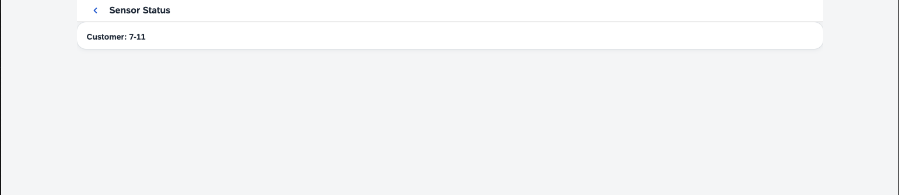
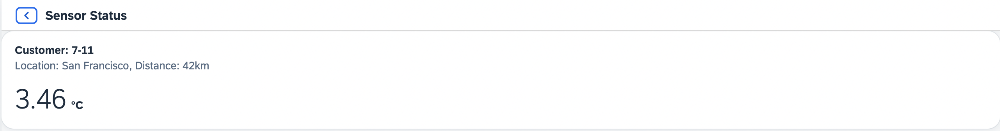
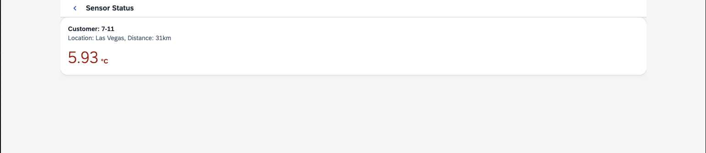

[](sensormanager)

# Exercise 8 - Card with NumericHeader

In this exercise you'll enhance the sensor status page with an `sap.f.Card` to show more data about the sensor's status. You'll add some layouting with box controls and add an `sap.f.cards.NumericHeader` to properly display the temperature.

## Exercise 8.1 - Add a Card to SensorStatus.view.xml

Now you'll dress up the `SensorStatus.view.xml` view.

1. Open `keepcool.keepcool.sensormanager/webapp/view/SensorStatus.view.xml`.

2. Add the `sap.f`, `sap.f.cards` and `sap.ui.core` libraries to `SensorStatus.view.xml`.

	***keepcool.sensormanager/webapp/view/SensorStatus.view.xml***

	````xml
	<mvc:View
		controllerName="keepcool.sensormanager.controller.SensorStatus"
		displayBlock="true"
		xmlns:core="sap.ui.core"
		xmlns:mvc="sap.ui.core.mvc"
		xmlns="sap.m"
		xmlns:f="sap.f"
		xmlns:card="sap.f.cards">
	````

3. Add an `sap.f.Card` with a card header to `SensorStatus.view.xml`. Enter the customer name as the header title via data binding.

	***keepcool.sensormanager/webapp/view/SensorStatus.view.xml***

	````xml
		<Page
			id="SensorStatusPage"
			title="{i18n>titleSensorStatus}"
			showNavButton="true"
			navButtonPress="onNavBack">
			<content>
				<VBox class="sapUiContentPadding">
				<f:Card>
					<f:header>
						<card:Header
							core:require="{
								formatMessage: 'sap/base/strings/formatMessage',
								formatter: 'keepcool/sensormanager/model/formatter'
							}"
							title="{
								parts: ['i18n>cardTitle', 'sensorModel>customer'],
								formatter: 'formatMessage'
							}"/>
					</f:header>
					<f:content>

					</f:content>
				</f:Card>
				</VBox>
			</content>
		</Page>
	````

## Exercise 8.2 - Enhance SensorStatus.controller.ts

To be able to show the data in your card, you need to assign the correct binding context using the information provided by the navigation step.

1. Open `keepcool.sensormanager/webapp/controller/SensorStatus.controller.ts`.

2. Attach a callback function to the `routeMatched` event to retrieve the selected index and bind it to the current view.

	***keepcool.sensormanager/webapp/controller/SensorStatus.controller.ts***

	````ts
		public onInit(): void {
			this.getRouter().getRoute("sensorStatus")?.attachMatched(this.onRouteMatched.bind(this));
		}

		public onRouteMatched(event: Route$MatchedEvent): void {
			this.getView()?.bindElement({
				path: "/sensors/" + (event.getParameter("arguments") as { index: string }).index,
				model: "sensorModel"
			});
		}
	````

3. Switch to the browser tab where the application preview is opened. Click any sensor. Now the sensor status page contains a card with the customer name.
<br><br><br><br>

## Exercise 8.3 - Add a NumericHeader to the Card

To improve the visualization further, you will replace the `sap.f.card.Header` by the `sap.f.cards.NumericHeader` in your newly created card.

1. Open `keepcool.sensormanager/webapp/view/SensorStatus.view.xml` and add the following content:

	***keepcool.sensormanager/webapp/view/SensorStatus.view.xml***

	````xml
					<f:header>
						<card:NumericHeader
							core:require="{
								formatMessage: 'sap/base/strings/formatMessage',
								formatter: 'keepcool/sensormanager/model/formatter'
							}"
							title="{
								parts: ['i18n>cardTitle', 'sensorModel>customer'],
								formatter: 'formatMessage'
							}"
							subtitle="{
								parts: [
									'i18n>cardSubTitle',
									'i18n>locationLabel',
									'sensorModel>location',
									'i18n>distanceLabel',
									'sensorModel>distance',
									'i18n>distanceUnit'
								],
								formatter: 'formatMessage'
							}"
							number="{sensorModel>temperature}"
							scale="{i18n>temperatureUnit}"/>
					</f:header>
	````

2. Switch to the browser tab where the application preview is opened. Click any sensor. Now the sensor status page contains a card which includes temperature information.
<br><br><br><br>

3. Add a formatter to provide semantic coloring for the card header.
The formatter fetches both the threshold and the current temperature from the model. On the basis of these values it then returns the `sap.m.ValueColor`.
Open `keepcool.sensormanager/webapp/model/formatter.ts` and add the formatter function given below. Don't forget to import the `sap.m.ValueColor` module, which provides nice color support!

	***keepcool.sensormanager/webapp/model/formatter.ts***

	```ts
	import { ValueColor } from "sap/m/library";
	...

	export default {
		...
		formatValueColor(temperature: Threshold): ValueColor {
			if (temperature < Threshold.Warm) {
				return ValueColor.Neutral;
			} else if (temperature >= Threshold.Warm && temperature < Threshold.Hot) {
				return ValueColor.Critical;
			} else {
				return ValueColor.Error;
			}
		}
	```

4. The `sap.f.cards.NumericHeader` control provides a `state` property, which allows you to render the state of your control in a fancy way. Open `keepcool.sensormanager/webapp/view/SensorStatus.view.xml`.

5. Add the `state` property to your numeric header and enter data binding information pointing to your newly created formatter function.

	***keepcool.sensormanager/webapp/view/SensorStatus.view.xml***

	````xml
					<f:header>
						<card:NumericHeader
							core:require="{
								formatMessage: 'sap/base/strings/formatMessage',
								formatter: 'keepcool/sensormanager/model/formatter'
							}"
							title="{
								parts: ['i18n>cardTitle', 'sensorModel>customer'],
								formatter: 'formatMessage'
							}"
							subtitle="{
								parts: [
									'i18n>cardSubTitle',
									'i18n>locationLabel',
									'sensorModel>location',
									'i18n>distanceLabel',
									'sensorModel>distance',
									'i18n>distanceUnit'
								],
								formatter: 'formatMessage'
							}"
							number="{sensorModel>temperature}"
							scale="{i18n>temperatureUnit}"
							state="{
								parts: [
									'sensorModel>temperature'
								],
								formatter: 'formatter.formatValueColor'
							}"/>
					</f:header>
	````

6. Switch to the browser tab where the application preview is opened. Click any sensor. Now the sensor status page contains a card with colored temperature information depending on the value of the temperature.
<br><br><br><br>

## Summary

Yay! You've successfully completed [Exercise 8 - Card with NumericHeader](#exercise-8---card-with-numericheader). Great! You've just finished a basic UI5 application and became one step closer in becoming a UI5 expert.

## Further Information
* Cards: https://ui5.sap.com/#/topic/5b46b03f024542ba802d99d67bc1a3f4
* `sap.f.Card`: https://ui5.sap.com/#/api/sap.f.Card
* `sap.f.cards.NumericHeader`: https://ui5.sap.com/#/api/sap.f.cards.NumericHeader
* Methods and Events for Navigation: https://ui5.sap.com/#/topic/516e477e7e0b4e188b19a406e7528c1e
