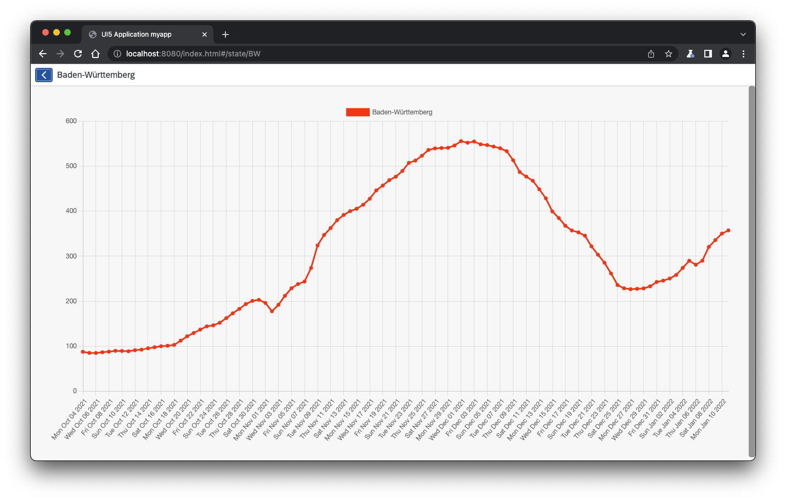
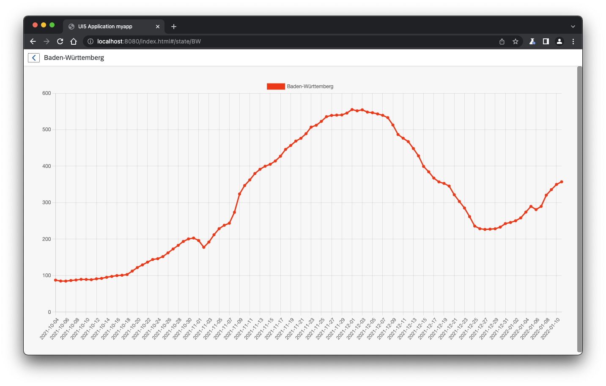
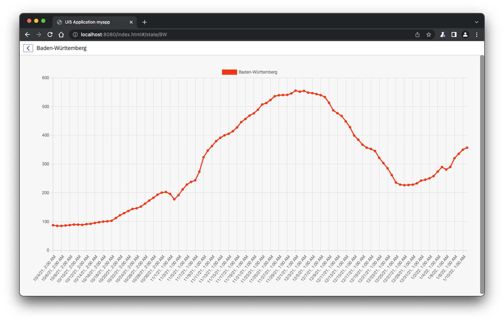

# Exercise 9 - OPTIONAL - Beautifying the Chart

In this exercise, you will learn how to use a formatter to beautify the date time values for the x-axis of the `LineChart`. The date time values are provided as a string in the format `yyyy-MM-dTHH:mm:ss.nnnZ`. This format can be understood by the `Date` object and the `Date` object can be used to convert the date time object into a human readable date time format. Later, the chapter explains how to use the `sap/ui/core/format/DateFormat` helper to render the date in a human readable form first in TypeScript and later purely in XML with the help of the built-in type `sap.ui.model.type.DateTime`.

## Exercise 9.1 - Using a Formatter Function to Display the DateTime String

You already have used a formatter function to display the proper icon to reflect the severity of the incidence in a state. In this chapter, a formatter function is used to convert the date time string into a human readable date.

In the file `src/view/IncidenceDetail.view.xml` use the following data binding configuration for the label property:

```xml
			<cc:ChartRecord
				label='{
					path: "incidenceHistory>date",
					formatter: ".formatDate"
				}'
				value ="{incidenceHistory>weekIncidence}"/>
```

In the file `src/controller/IncidenceDetail.controller.ts` add the following function to format the date time string:

```js
	formatDate(date: string) {
		return new Date(date).toDateString();
	}
```

Now, the chart displays the date and time as a human-readable string:

```text
Mon Jan 10 2022
```



## Exercise 9.2 - Use the DateTimeFormat

In the `IncidenceDetail.controller.ts` replace the former `formatDate` function with the following one to use the `sap/ui/core/format/DateFormat`to parse and format the date time string:

```ts
	private dfSource: DateFormat;
	private dfTarget: DateFormat;

	formatDate(date: string) {
		if (!this.dfSource && !this.dfTarget) {
			this.dfSource = DateFormat.getDateTimeInstance({
				pattern: "yyyy-MM-ddTHH:mm:ss.nnnZ"
			});
			this.dfTarget = DateFormat.getDateTimeInstance({
				pattern: "yyyy-MM-dd"
			});
		}
		return this.dfTarget.format(this.dfSource.parse(date, true, true), true);
	}
```

The `DateFormat` is not available in this module yet, so it needs to be imported as described in exercise 2, e.g. by using the "Quick Fix..." in the error popup. In the end, you should have the following import line:

```ts
import DateFormat from "sap/ui/core/format/DateFormat";
```

This code above creates two instances of `DateFormat` the first time the `formatDate` formatter function is called. The `dfSource` is used to parse the incoming string format from the data source and the `dfTarget` is used to finally format the parsed date as a date string. The resulting date format should look like this:

```text
2022-01-10
```



## Exercise 9.3 - Using a Type to Format the DateTime String

The same as above can be achieved by using a binding object using a `type` and `formatOptions`. This step is shown just for completeness to show the declarative way of formatting. If you want to do so, open the `src/controller/IncidenceDetail.controller.ts` and remove the coding from above again. Then, inside the `src/view/IncidenceDetail.view.xml` file, replace the `<ChartRecord...` element with the following one which contains a binding object:

```xml
			<cc:ChartRecord
				label='{
					path: "incidenceHistory>date",
					type: "sap.ui.model.type.DateTime",
					formatOptions: {
						style: "short",
						source: {
							pattern: "yyyy-MM-ddTHH:mm:ss.nnnZ"
						}
					}
				}'
				value ="{incidenceHistory>weekIncidence}"/>
```

Data types transform a source value (given value in the model) into a formatted date+time string and the other way round.

The format patterns must be defined in [LDML](https://unicode.org/reports/tr35/tr35-dates.html) Date Format notation. For the output, the use of a style ("short, "medium", "long" or "full") instead of a pattern is preferred, as it will automatically use a locale-dependent date and time pattern.

After you followed the steps above, your detail page of the application should look like this:



## Summary

Congratulations, you have also finished the last exercise of this tutorial. In this chapter, you learned how you can format data using a formatter function or using data types to make the date time strings in the chart better readable.

The result can also be downloaded as described in the exercises section of the tutorials' [README](../../README.md#exercises).
